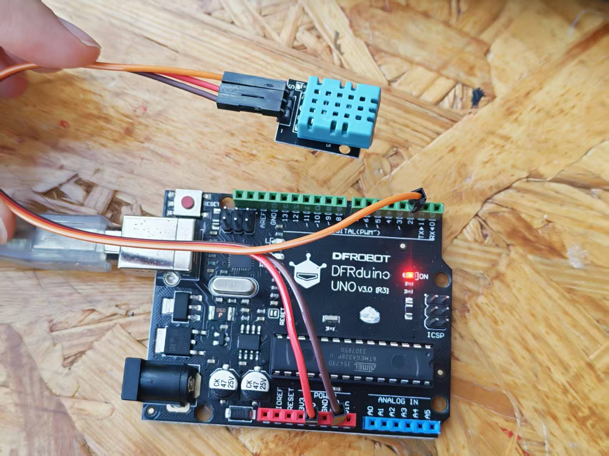
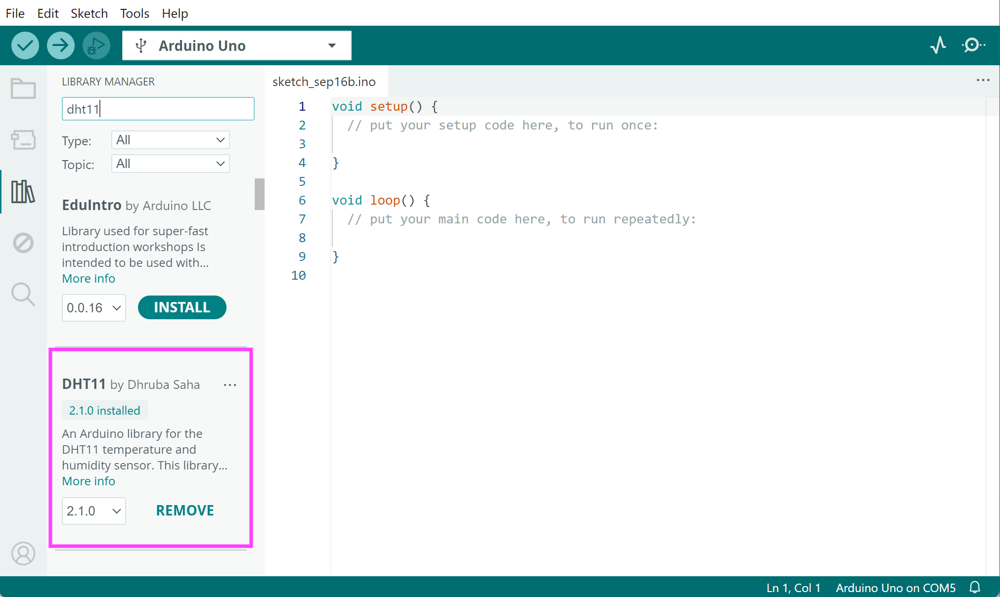
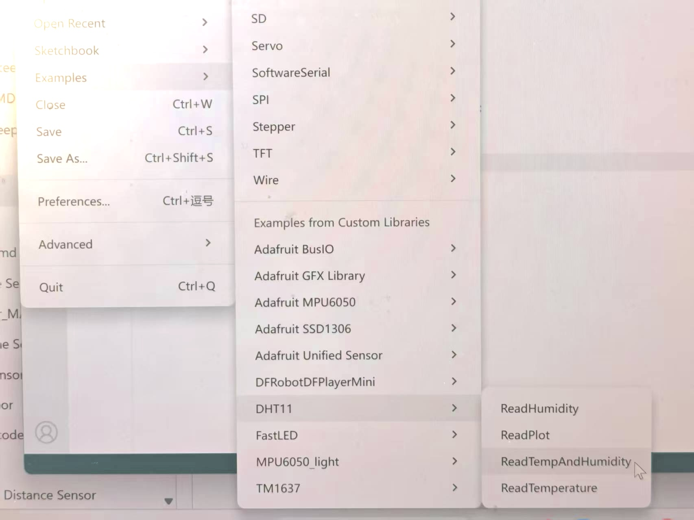

# DHT11 Digital Temperature and Humidity Sensor

The DHT11 is a digital humidity‑temperature sensor that measures temperature and relative humidity data.

**The example code** shows you how to use the DHT11 in Arduino using the DHT11 by Dhruba Saha.


## Hardware

The sensor is capable of measuring temperatures ranging from 0°C to 50°C with an accuracy of ±2.0°C, and humidity levels between 20% and 80% with 5% accuracy.

Another important detail is how often it updates its readings. The DHT11 has a sampling rate of 1 Hz, which means it can give you new data once every second.


###  Circuit Setup

* 1 x Arduino Uno
* 3 x Jumper Wires (M/F)
* 1 x DHT11


|DHT11    | Arduino Uno        | 
| ------------- |:-------------:| 
| GND     | GND | 
| VCC     | 5V     |   
| SIG |  D2   | 

Now you’re ready to connect the DHT11 module to your Arduino.

Start by connecting the – (GND) pin to one of the Arduino GND pins. 

Next, connect the module’s Out pin (S) to digital pin 2 on the Arduino.

Finally, connect the + (VCC) pin to the Arduino’s 5V pin. 



<br />
- Download the DHT11 library in your Arduino IDE first.

  
<br />


- In your ArduinoIDE, go to File -> Examples -> DHT11 -> ReadTempAndHumidity

  

After installing the library, copy and paste this sketch into the Arduino IDE.

This test sketch will print the temperature and relative humidity values to the serial monitor.


 

```C++
/**
 * DHT11 Sensor Reader
 * This sketch reads temperature and humidity data from the DHT11 sensor and prints the values to the serial port.
 * It also handles potential error states that might occur during reading.
 *
 * Author: Dhruba Saha
 * Editor: Helen Zhang
 * Version: 2.1.0
 * License: MIT
 */

// Include the DHT11 library for interfacing with the sensor.
#include <DHT11.h>

// Connect the sensor to Digital Pin 2.
DHT11 dht11(2);

void setup() {
    Serial.begin(9600);
}

void loop() {
    int temperature = 0;
    int humidity = 0;

    // Attempt to read the temperature and humidity values from the DHT11 sensor.
    int result = dht11.readTemperatureHumidity(temperature, humidity);

    // Check the results of the readings.
    // If the reading is successful, print the temperature and humidity values.
    // If there are errors, print the appropriate error messages.
    if (result == 0) {
        Serial.print("Temperature: ");
        Serial.print(temperature);
        Serial.print(" °C\tHumidity: ");
        Serial.print(humidity);
        Serial.println(" %");
    } else {
        // Print error message based on the error code.
        Serial.println(DHT11::getErrorString(result));
    }
}
```
<br />
<br />
<br />
<br />
<br />


