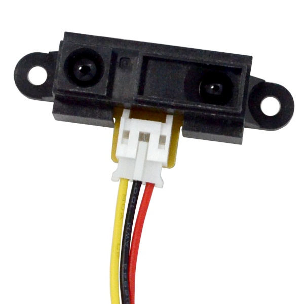
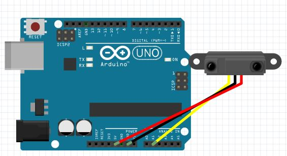

# IR Distance Sensor 10-80CM - GP2Y0A21YK0F



In this tutorial we will use the Sharp IR sensor (GP2Y0A21YK0F) to measure distance from an object.

IR Sensors work by using a specific light sensor to detect a select light wavelength in the Infra-Red (IR) spectrum. By using an LED which produces light at the same wavelength as what the sensor is looking for, you can look at the intensity of the received light. When an object is close to the sensor, the light from the LED bounces off the object and into the light sensor. This results in a large jump in the intensity, which we already know can be detected using a threshold.

Since the sensor works by looking for reflected light, it is possible to have a sensor that can return the value of the reflected light. This type of sensor can then be used to measure how "bright" the object is. This is useful for tasks like line tracking.

In this tutorial we will try to measure the distance from an object (10~80cm).

## Circuit Diagram



## Arduino Code

``` C++
#define sensor A0 // Sharp IR GP2Y0A21YK0F (10-80cm, analog)

void setup() {
  Serial.begin(9600);
}

void loop() {
  float volts = analogRead(sensor) * (5.0 / 1024.0);
  float distance = 29.988 * pow(volts, -1.173); // fit for GP2Y0A21

  if (distance >= 10 && distance <= 80) {
    Serial.println(distance);
  }
  delay(100);
}
```
