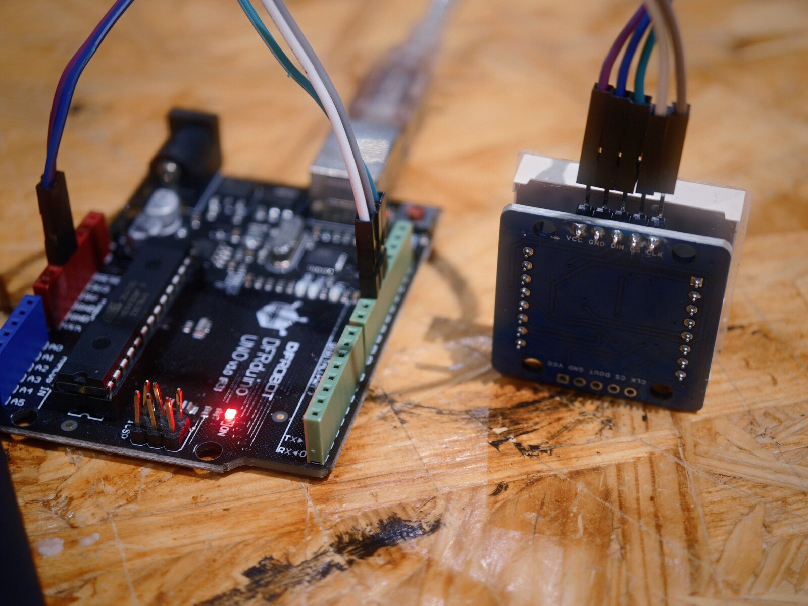
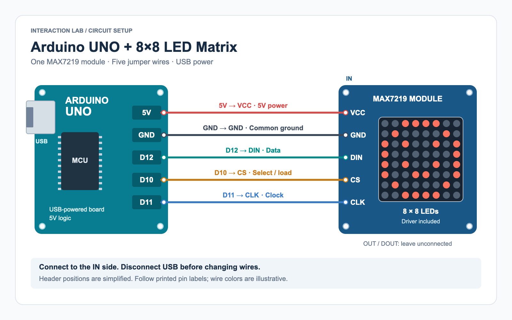
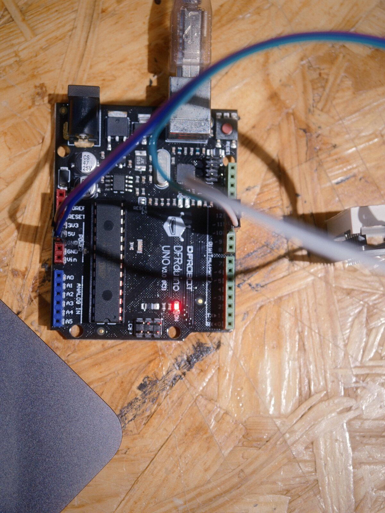
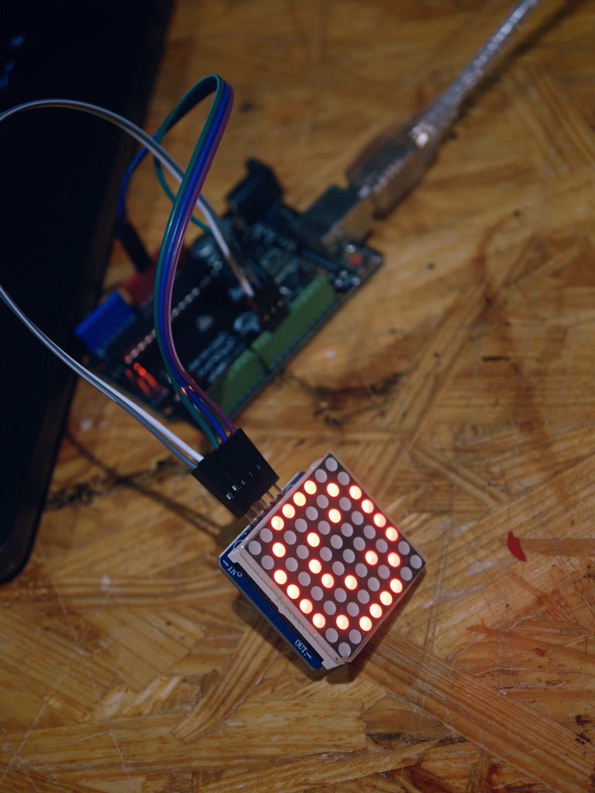
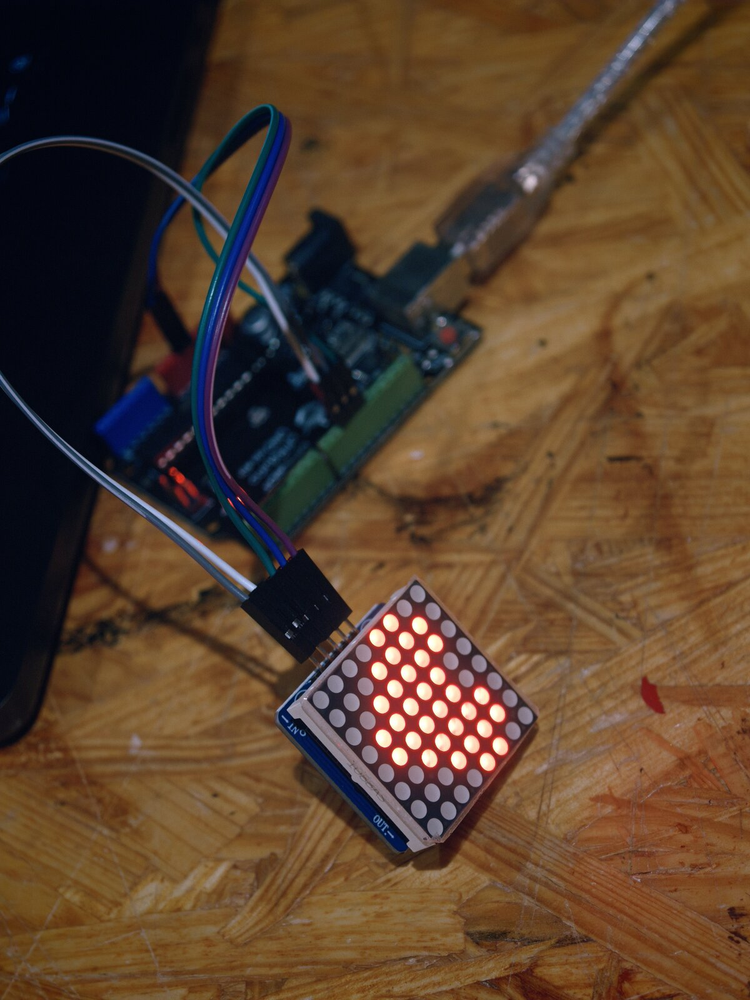

# 8×8 LED Matrix

This tutorial shows how to connect a MAX7219 8×8 LED matrix module to an Arduino Uno, control individual LEDs, and display a smiley face and a heart.

## Hardware

An 8×8 LED matrix contains 64 LEDs arranged in eight rows and eight columns. Each LED acts as a pixel, allowing the display to show symbols, letters, and simple animations. As an output device, it can provide visual feedback in an interactive project.

The module used here includes a MAX7219 driver, which handles LED scanning and brightness control. The Arduino sends display data through three signal wires, plus two wires for power and ground. This tutorial is for a module with a driver board, not a bare LED matrix.



*The input header is labeled VCC, GND, DIN, CS, and CLK. The opposite header is used to connect another module.*

### Circuit Setup

You will need:

- 1 × Arduino Uno
- 1 × MAX7219 8×8 LED matrix module
- 5 × male-to-female jumper wires
- 1 × USB data cable
- A computer with Arduino IDE installed

Disconnect USB power before wiring. Connect the **IN** side of the module to the Arduino as shown below.



| Arduino Uno | Matrix module (IN) | Function |
| --- | --- | --- |
| 5V | VCC | Power |
| GND | GND | Common ground |
| D12 | DIN | Display data |
| D10 | CS / LOAD | Select / load |
| D11 | CLK | Clock |

Follow the printed pin labels on your boards: header positions in the diagram are simplified, and wire colors do not need to match. Leave the **OUT / DOUT** side unconnected.

For this single-module example at low brightness, the module can be powered from the Uno's 5V pin while the Uno is connected by USB. No breadboard or additional external resistor is needed for this assembled module. Multiple modules may require a separate regulated 5V supply.

**Arduino connections**




## Code

1. Open **Library Manager** in Arduino IDE. Search for **LedControl** and install the library by **Eberhard Fahle**.
2. Open [MatrixDemo.ino](./MatrixDemo/MatrixDemo.ino), or copy the complete code below into a new sketch.
3. Connect the Arduino to your computer. Select **Arduino Uno** and the correct serial port.
4. Click **Verify**, then **Upload**.

The display should light one pixel for one second, scan all 64 pixels in about four seconds, and then alternate between a smiley face and a heart every second. Press **RESET** to repeat the initial pixel test.

```cpp
#include <LedControl.h>

// Connect the module's IN side: DIN -> D12, CLK -> D11, CS -> D10.
// The last argument is the number of modules, not the device address.
LedControl matrix(12, 11, 10, 1);

const byte smile[8] = {
  B00111100,
  B01000010,
  B10100101,
  B10000001,
  B10100101,
  B10011001,
  B01000010,
  B00111100
};

const byte heart[8] = {
  B00000000,
  B01100110,
  B11111111,
  B11111111,
  B01111110,
  B00111100,
  B00011000,
  B00000000
};

void showPattern(const byte pattern[]) {
  for (int row = 0; row < 8; row++) {
    matrix.setRow(0, row, pattern[row]);
  }
}

void setup() {
  matrix.shutdown(0, false);  // Wake up the first module (address 0).
  matrix.setIntensity(0, 2); // Brightness: 0 (dim) through 15 (bright).
  matrix.clearDisplay(0);

  // Step 1: one pixel for one second.
  matrix.setLed(0, 0, 0, true);
  delay(1000);
  matrix.clearDisplay(0);

  // Step 2: visit all 64 pixels once to check the display and orientation.
  for (int row = 0; row < 8; row++) {
    for (int col = 0; col < 8; col++) {
      matrix.setLed(0, row, col, true);
      delay(60);
      matrix.setLed(0, row, col, false);
    }
  }
}

void loop() {
  // Step 3: switch between two frames, once per second.
  showPattern(smile);
  delay(1000);
  showPattern(heart);
  delay(1000);
}
```

### How It Works

`LedControl matrix(12, 11, 10, 1)` sets the DIN, CLK, and CS pins, followed by the number of modules. The final `1` means one module; the first `0` in the display commands is that module's address. LedControl drives these signals in software, so these are the pins selected for this sketch rather than a required hardware SPI mapping.

In `setup()`, `shutdown(0, false)` wakes the module, `setIntensity(0, 2)` sets a low brightness, and `clearDisplay(0)` turns off all pixels. Brightness values range from 0 to 15; 0 is the dimmest setting, not off.

`setLed(0, row, col, true)` lights one pixel. Rows and columns are numbered from 0 to 7. Setting the last argument to `false` turns that pixel off.

Each pattern contains eight bytes, one for each row. Within a byte, `1` turns an LED on and `0` turns it off. For example, `B00111100` lights four pixels in the middle of a row. `showPattern()` uses `setRow()` to send all eight rows to the display.

## Result

<p>
  
  
</p>

*The smiley face and heart displayed on the assembled circuit.*

### Try It Yourself

Draw a symbol on an 8×8 grid. Write `1` for each filled square and `0` for each empty square, then replace the eight rows in the `heart` array with your design. Upload the sketch again to see your own pixel art.

To change the animation speed, edit the two `delay(1000)` values in `loop()`. For example, `delay(500)` displays each pattern for half a second. The delays in this introductory sketch pause program execution; a project that also needs responsive sensor input can use `millis()` for timing.

## Troubleshooting

| Problem | What to check |
| --- | --- |
| `LedControl.h: No such file or directory` | Install the LedControl library in Library Manager. |
| The sketch will not upload | Check the board selection, serial port, and USB data cable. |
| Upload succeeds, but the display is blank | Check 5V, GND, the IN header, and all three signal connections. Confirm the sketch calls `shutdown(0, false)`. |
| The image is rotated or mirrored | Module orientation and internal wiring can differ. Use the pixel scan to identify row and column directions. Rotate the module for a rotated image; mirrored or transposed images need a change to the pixel mapping. |
| The display flickers or the Arduino restarts | Check for loose connections, use short wires, and check that the power supply is adequate. Start with low brightness. |

## References

- [LedControl software documentation](https://wayoda.github.io/LedControl/pages/software)
- [LedControl hardware and power supply notes](https://wayoda.github.io/LedControl/pages/hardware.html)
- [LedControl source code](https://github.com/wayoda/LedControl)
- Tutorial structure follows the Interaction Lab [4-Digit 7-Segment Display](https://github.com/ima-nyush/Interaction-Lab/blob/main/02.Actuators/4-Digit%207-Segment%20Display/README.md) and [Solenoid](https://github.com/ima-nyush/Interaction-Lab/blob/main/02.Actuators/Solenoid/README.md) tutorials.

[Download the editable SVG wiring diagram](./Images/uno-max7219-wiring.svg).
