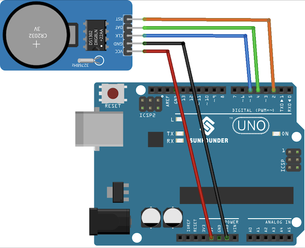

# DS1302 Real-Time Clock 

The Arduino has no built-in clock. It only knows how long it has been running since it was last powered on or reset. When it loses power, that count starts over.

The DS1302 counts seconds, minutes, hours, day, month, and year on its own, powered by its coin battery. 

---

## What you need

- Arduino Uno and USB cable
- DS1302 RTC module
- 5 female-to-male jumper wires
- Arduino IDE


## Step 1: Install the library

1. Open the Arduino IDE.
2. Go to **Sketch → Include Library → Manage Libraries**.
3. Search for **Rtc by Makuna**.
4. Click **Install**.

There are several DS1302 libraries. This guide uses Rtc by Makuna because it's actively maintained and its example sketch uses the same wiring as this guide.

---

## Step 2: Wire the module

| DS1302 | Uno |
|---|---|
| VCC | 5V |
| GND | GND |
| CLK | D5 |
| DAT | D4 |
| RST | D2 |



---

## Step 3: Set and read the time

When you upload this sketch, it sets the RTC to your computer's time (if the RTC is behind). After that, it prints the time to the Serial Monitor once per second.

Open the Serial Monitor (**Tools → Serial Monitor**) at **9600 baud** to see it.

```cpp
#include <ThreeWire.h>
#include <RtcDS1302.h>

ThreeWire myWire(4, 5, 2);  // DAT, CLK, RST
RtcDS1302<ThreeWire> Rtc(myWire);

void setup() {
  Serial.begin(9600);
  Rtc.Begin();
  Rtc.SetIsWriteProtected(false);
  Rtc.SetIsRunning(true);

  // Set the clock to your computer's time if the clock is behind
  RtcDateTime compiled = RtcDateTime(__DATE__, __TIME__);
  if (Rtc.GetDateTime() < compiled) {
    Rtc.SetDateTime(compiled);
  }
}

void loop() {
  RtcDateTime now = Rtc.GetDateTime();

  Serial.print(now.Hour());
  Serial.print(":");
  Serial.print(now.Minute());
  Serial.print(":");
  Serial.println(now.Second());

  delay(1000);
}
```

The time prints without leading zeros, so 9:05:03 shows as `9:5:3`.

---

## Step 4: Use the time in a project

Once you can read the time, you can make things happen at specific times. This example turns on the built-in LED (pin 13) between 8:00 and 18:00.

Add this to the end of `loop()` in the Step 3 sketch:

```cpp
  int hour = now.Hour();

  if (hour >= 8 && hour < 18) {
    digitalWrite(13, HIGH);
  } else {
    digitalWrite(13, LOW);
  }
```

### Available time values

| Function | Returns |
|---|---|
| `now.Year()` | Year (e.g. 2026) |
| `now.Month()` | 1–12 |
| `now.Day()` | 1–31 |
| `now.Hour()` | 0–23 |
| `now.Minute()` | 0–59 |
| `now.Second()` | 0–59 |
| `now.DayOfWeek()` | 0–6 (0 = Sunday) |

---

## Troubleshooting

| Problem | Fix |
|---|---|
| Time shows `0:0:0` or random numbers | Check wiring. Confirm the pin numbers in `ThreeWire myWire(4, 5, 2)` match your wires (order is DAT, CLK, RST). |
| Time doesn't change (stuck on one second) | The clock isn't running. Make sure `Rtc.SetIsRunning(true)` runs in `setup()`. |
| Time is wrong after the Arduino was unplugged | No battery, dead battery, or battery inserted upside down. Replace it and re-upload the Step 3 sketch. |
| Time is off by a few minutes after a few weeks | Normal. The DS1302 drifts over time. Re-set it, or switch to a DS3231 module if you need higher accuracy. |
| Compile error: `RtcDS1302.h: No such file` | The library isn't installed. Redo Step 1. |

---

## References

- [Rtc by Makuna library](https://github.com/Makuna/Rtc)
- [DS1302 example sketch](https://github.com/Makuna/Rtc/blob/master/examples/DS1302_Simple/DS1302_Simple.ino)
- [Rtc library wiki](https://github.com/Makuna/Rtc/wiki)
