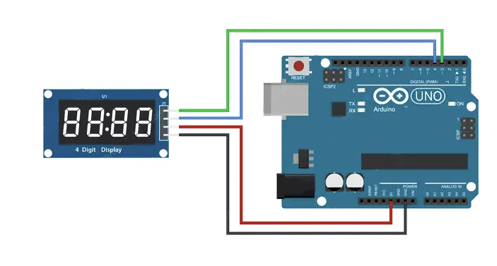

# 4-Digit 7-Segment Display

This is a simple tutorial for the 4-Digit 7-Segment Display TM1637 Connected to an Arduino Uno.

## Hardware


The TM1637 Module has only four pins which is great for any project involving a clock, timer, or a counter.
It consists of seven LEDs arranged in a ‘8’ shaped pattern. Each LED is referred to as a segment, because when illuminated, it forms part of a digit. There are 4 digits in total.


### Circuit Setup

* 1 x Arduino Uno
* 4 x Jumper Wires M/F
* 1 x TM1637 Display


 

1. Go to the Library Manager in your Arduino IDE and install the "TM1637" library by Avishay Orpaz.
2. Connect the Display module as showcased on the diagram above.


## Code
Upload the code to your board and see how the counter is displayed on the screen!
```C++
#include <TM1637Display.h>

// Module connection pins (Digital Pins)
#define CLK 3
#define DIO 4
TM1637Display display(CLK, DIO);

// Counter to display
int count;

void setup() {
  display.setBrightness(5);  // (0=dimmest 7=brightest)
}

void loop() {
  count = count + 1;
  display.showNumberDec(count, false); // Display an int variable 
  delay(50);
}

```


