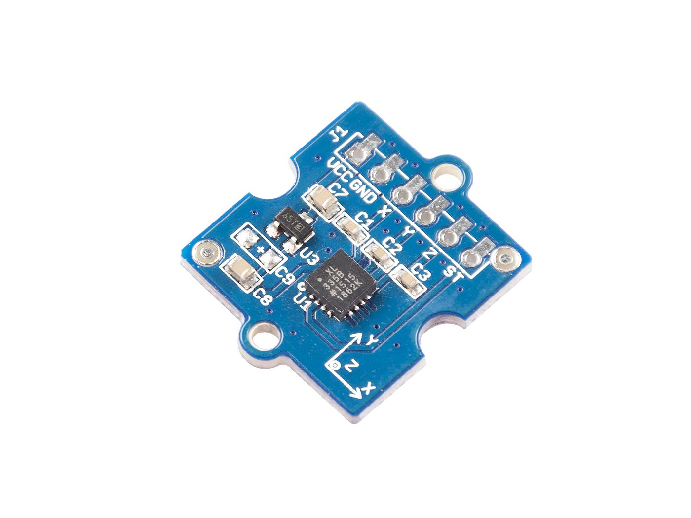
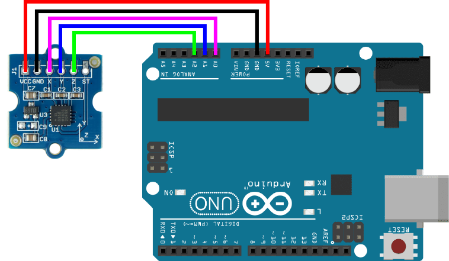

# 3 Axis Analog Accelerometer
The 3 Axis Analog Accelerometer, as it name suggests, is used to detect acceleration along three axes: **left-right(X), forward-backward(Y), up/down(Z)**. Aside from dynamic acceleration (motion, shock, vibration), it can also detect gravitational acceleration allowing it to detect tilt.
## Hardware
The accelerometers we keep in stock are ADXL335 which have 6 pins: VCC, GND, X, Y, Z, Self-Test(ST). Since the ST pin is used only for testing purposes, we do not need to connect that pin for normal usage.


## Circuit Setup


## Code Example
### Basic (Raw Data)
The code below gets a basic reading on the three values from the accelerometer. 
```C++
//initialize x,y,z values
int xValue;
int yValue;
int zValue;

void setup() {
  Serial.begin(9600);
}

void loop() {
  //analogRead the 3 axes
  xValue = analogRead(A0);
  yValue = analogRead(A1);
  zValue = analogRead(A2);

  //results
  Serial.print("x,y,z = ");
  Serial.print(xValue);
  Serial.print(", ");
  Serial.print(yValue);
  Serial.print(", ");
  Serial.print(zValue);
  Serial.println();
  //small delay for stability
  delay(10);
}
```
### Tilt Calibration
In order to make the values a bit more intelligible/usable, it would be wise to remap the raw values. However, the default values may be quite unstable and at a rather abnormal range. In order to find an approximate minimum/maximum value, first keep the sensor as still as possible in its default resting state (usually facing upward). Watch the serial monitor and approximate the three values. In this current case, we get about 250, 250, 300. Now along one axis at a time, tilt it forward and backward and again look at the serial monitor to approxiate the largest and smallest value you see (I get a change of about 40 in any direction, but again, this may be slightly different in your case). We can now use these as our min/max values when remapping. The updated code looks like this:

```C++
//initialize x,y,z values
int xValue;
int yValue;
int zValue;
//the desired range (min/max) for remapping
int mapMin = 0;
int mapMax = 1023;

void setup() {
  Serial.begin(9600);
}

void loop() {
  //analogRead the 3 axes
  xValue = analogRead(A0);
  yValue = analogRead(A1);
  zValue = analogRead(A2);

  //remap values & constrain to ensure we stay within the desired range
  xValue = constrain(map(xValue, 210, 290, mapMin, mapMax), mapMin, mapMax);
  yValue = constrain(map(yValue, 210, 290, mapMin, mapMax), mapMin, mapMax);
  zValue = constrain(map(zValue, 210, 290, mapMin, mapMax), mapMin, mapMax);

  //results
  Serial.print("x,y,z = ");
  Serial.print(xValue);
  Serial.print(", ");
  Serial.print(yValue);
  Serial.print(", ");
  Serial.print(zValue);
  Serial.println();

  //small delay for stability
  delay(10);
}
```

### Motion/Knock/Vibration Calibration

Calibrating for dynamic acceleration can be a bit trickier than for just tilt. 
