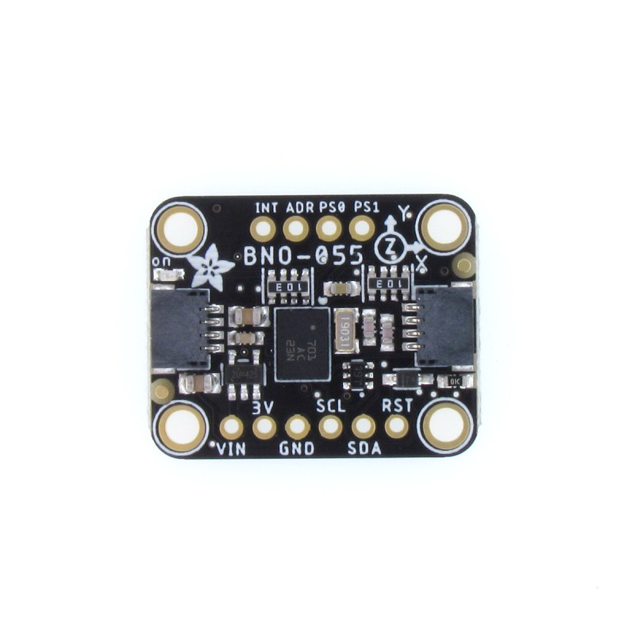
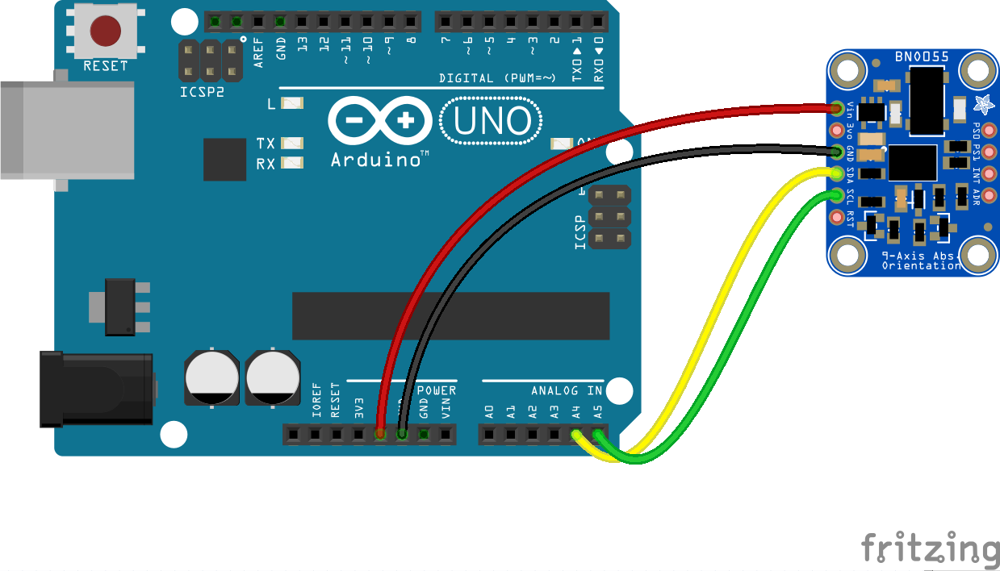

# IMU (Inertial measurement unit) - BNO055

The BNO055 is an 9-DOF inertial measurement unit that calculates three-axis accelerometer and three-axis gyroscope data, and the absolute directions.

The first example code shows you how to use the BNO055 in Arduino only and prints the Pitch, Yaw and Roll data in degrees(°) in the serial monitor.

## HardWare
 
Gyroscope – The gyroscope measures rotational velocity or rate of change of the angular position over time, along the X, Y and Z axis.

Accelerometer – The accelerometer can measure both static and dynamic forces of acceleration, along the X, Y and Z axis. The earth gravitational force is a typical example of static force, while dynamic forces can be caused by vibrations, movements and so on.

### Example 1 - Circuit Setup

1 x Arduino Uno
4 x Jumper Wires (M/F)
1 x BNO055



| BNO055 | Arduino Uno |
| ------ | :---------: |
| GND    |     GND     |
| VCC    |     5V      |
| SDA    |     A4      |
| SCL    |     A5      |


Download the Adafruit_BNO055 library in your Arduino IDE first.

Arduino Example Code:

```cpp
#include <Wire.h>
#include <Adafruit_Sensor.h>
#include <Adafruit_BNO055.h>
#include <utility/imumaths.h>

/* Assign a unique ID to each sensor (can be any number) */
Adafruit_BNO055 bno1 = Adafruit_BNO055(55, BNO055_ADDRESS_A); // Address 0x28

void setup(void) {
  Serial.begin(9600);
  Serial.println("\nTwo BNO055 Sensors Test");

  /* Initialize BNO055 sensor 1 */
  if(!bno1.begin())
  {
    /* There was a problem detecting the BNO055 ... check your connections */
    Serial.print("Ooops, no BNO055 sensor 1 detected ... Check your wiring or I2C address!");
    while(1);
  }

  delay(1000);

  /* Use external crystal for better accuracy */
  bno1.setExtCrystalUse(true);

}

void loop(void) {
  // Get a new sensor event for sensor 1
  sensors_event_t event1;
  bno1.getEvent(&event1);

  // Print data for Sensor 1
  Serial.print("Sensor 1: Orientation X: ");
  Serial.print(event1.orientation.x, 4);
  Serial.print(" Y: ");
  Serial.print(event1.orientation.y, 4);
  Serial.print(" Z: ");
  Serial.print(event1.orientation.z, 4);
  Serial.println("");


  delay(1000);
}
```