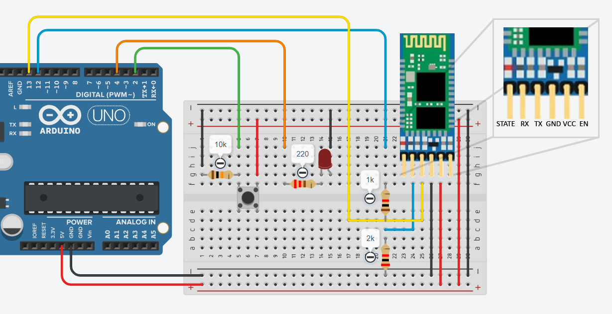
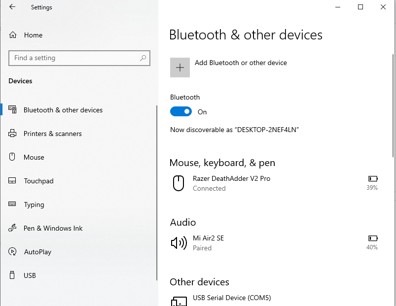
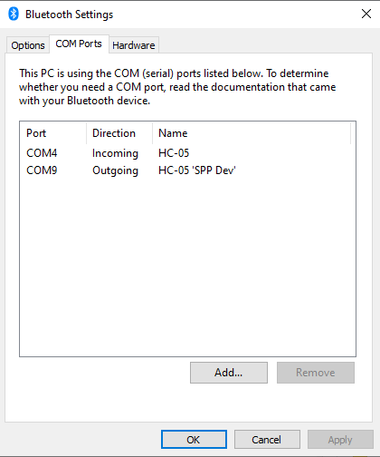

# Bluetooth Module (HC-05)

## Intro

This tutorial will show you how to make a 2 way Serial connection between your arduino and Processing through the bluetooth module. For this demonstration we are using an Arduino Uno, a HC-05 Bluetooth module, then a button to send a send a digital signal to Processing, and an LED to register incoming values from Processing. The code for Serial communication is based on examples given in class.

## Circuit Setup

Note the 5 pins are (in order left to right) STATE, RX, TX, GND, VCC, and EN. Do note the resistors for the RX pin which help prevent the module from burning out; they are necessary because the digital pin has a max output of 5v whereas the HC-05 takes a 3.3v signal. The TX pin does not require any resistors since we are sending a lower voltage signal to the higher voltage digital pin.

STATE is used to determine whether there is an active connection or not, returning HIGH if there is an established connection and LOW if not. EN is used to set the HC-05 in either data mode (LOW) or AT command mode (HIGH). This is useful when configurations for the HC-05 are needed, such as setting the name/password. For the purpose of this tutorial, we may ignore these two pins and just focus on creating the connection with your computer, and sending/receiving data to/from Processing.

## Bluetooth Setup

### Windows

Once you have your circuit set up, go to **Bluetooth & Other Devices** in your control panel.

Simply click **Add Bluetooth or other device** then **Bluetooth** to start searching for the HC-05. Give it a moment and it should pop-up as **HC05**. Click it to pair with it. It will ask for a pin code which by default is set to **1234**.

Scroll down now and find **More Bluetooth Options** under **Related Settings**, the window below should pop up.

You'll see the results above when switching over to the **COM Ports** tab. You should now see 2 ports listed, one as incoming and the other as outgoing, make note of both port numbers. Now you are ready to move onto coding.

### MacOS

WIP

## Code
The code is based on [these examples here](https://github.com/ima-nyush/Interaction-Lab-Sp24/tree/main/10.1%20-%20Serial%20Communication%202/03_read_and_write) for Serial communication between Processing & Arduino.

The modified versions for this tutorial [are here](./sketches). Upload the arduino code to your board using a cable. Once you've done so, go to the Processing sketch and be sure to change your Serial port name to the one you noted down from the previous step. If everything is working correctly, the LED in your circuit should light up when the mouse is pressed in the Processing sketch. On the other hand, the button in your circuit should toggle the background color of your Processing sketch from blue (LOW) to red (HIGH).
