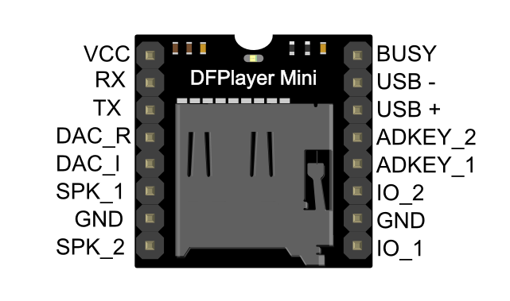

# DFPlayer Mini MP3 Player
This tutorial is made for NYUSH IMA community based on [DFROBOT DOCUMENTATION](https://wiki.dfrobot.com/DFPlayer_Mini_SKU_DFR0299).


## Introduction
The DFPlayer Mini MP3 Player For Arduino is a small and low cost MP3 module with an simplified output directly to the speaker. The module can be used as a stand alone module with attached battery, speaker and push buttons or used in combination with microcontrollers such as Arduino.

## Hardware



## Build the Circuit 

Note: The operating voltage of DFPlayer mini is 3.3 V, while most of the Arduino's operating voltage is 5 V. After our test, although it is possible to play music normally by directly connecting the Arduino directly to DFPlayer mini, there may be abnormal noises appearing. We recommend you to connect a 1k resistor in series with the RX pin of DFPlayer for voltage divider.


## Copy your mp3 into you micro SD card
NOTE: The order you copy the mp3 into micro SD card will affect the order mp3 played , which means play(1) function will play the first mp3 copied into micro SD card.
### For Mac User
NOTE: If you are using Mac OS X to copy the mp3, the file system will automatically add hidden files like: "._0001.mp3" for index, which this module will handle as valid mp3 files. It is really annoying. So you can run following command in terminal to eliminate those files.
```C++
dot_clean /Volumes/<SDVolumeName>
```

## Arduino Code
We've created an Arduino library for DFPlayer Mini to simplify the method for you to make it work. Connect the hardware as the picture above shown and play with the sample code. You can search in your Arduino software or you can download the latest library here: [DFRobotDFPlayerMini](https://github.com/DFRobot/DFRobotDFPlayerMini/tree/master).


### Sample code "GetStarted", switching to next song every 3 seconds
```C++
/***************************************************
DFPlayer - A Mini MP3 Player For Arduino
 <https://www.dfrobot.com/product-1121.html>

 ***************************************************
 This example shows the basic function of library for DFPlayer.

 Created 2016-12-07
 By [Angelo qiao](Angelo.qiao@dfrobot.com)

 GNU Lesser General Public License.
 See <http://www.gnu.org/licenses/> for details.
 All above must be included in any redistribution
 ****************************************************/

/***********Notice and Trouble shooting***************
 1.Connection and Diagram can be found here
 <https://www.dfrobot.com/wiki/index.php/DFPlayer_Mini_SKU:DFR0299#Connection_Diagram>
 2.This code is tested on Arduino Uno, Leonardo, Mega boards.
 ****************************************************/

#include "Arduino.h"
#include "DFRobotDFPlayerMini.h"

#if (defined(ARDUINO_AVR_UNO) || defined(ESP8266))   // Using a soft serial port
#include <SoftwareSerial.h>
SoftwareSerial softSerial(/*rx =*/10, /*tx =*/11);
#define FPSerial softSerial
#else
#define FPSerial Serial1
#endif

DFRobotDFPlayerMini myDFPlayer;
void printDetail(uint8_t type, int value);

void setup()
{
#if (defined ESP32)
  FPSerial.begin(9600, SERIAL_8N1, /*rx =*/D3, /*tx =*/D2);
#else
  FPSerial.begin(9600);
#endif

  Serial.begin(115200);

  Serial.println();
  Serial.println(F("DFRobot DFPlayer Mini Demo"));
  Serial.println(F("Initializing DFPlayer ... (May take 3~5 seconds)"));

  if (!myDFPlayer.begin(FPSerial, /*isACK = */true, /*doReset = */true)) {  //Use serial to communicate with mp3.
    Serial.println(F("Unable to begin:"));
    Serial.println(F("1.Please recheck the connection!"));
    Serial.println(F("2.Please insert the SD card!"));
    while(true){
      delay(0); // Code to compatible with ESP8266 watch dog.
    }
  }
  Serial.println(F("DFPlayer Mini online."));

  myDFPlayer.volume(10);  //Set volume value. From 0 to 30
  myDFPlayer.play(1);  //Play the first mp3
}

void loop()
{
  static unsigned long timer = millis();

  if (millis() - timer > 3000) {
    timer = millis();
    myDFPlayer.next();  //Play next mp3 every 3 second.
  }

  if (myDFPlayer.available()) {
    printDetail(myDFPlayer.readType(), myDFPlayer.read()); //Print the detail message from DFPlayer to handle different errors and states.
  }
}

void printDetail(uint8_t type, int value){
  switch (type) {
    case TimeOut:
      Serial.println(F("Time Out!"));
      break;
    case WrongStack:
      Serial.println(F("Stack Wrong!"));
      break;
    case DFPlayerCardInserted:
      Serial.println(F("Card Inserted!"));
      break;
    case DFPlayerCardRemoved:
      Serial.println(F("Card Removed!"));
      break;
    case DFPlayerCardOnline:
      Serial.println(F("Card Online!"));
      break;
    case DFPlayerUSBInserted:
      Serial.println("USB Inserted!");
      break;
    case DFPlayerUSBRemoved:
      Serial.println("USB Removed!");
      break;
    case DFPlayerPlayFinished:
      Serial.print(F("Number:"));
      Serial.print(value);
      Serial.println(F(" Play Finished!"));
      break;
    case DFPlayerError:
      Serial.print(F("DFPlayerError:"));
      switch (value) {
        case Busy:
          Serial.println(F("Card not found"));
          break;
        case Sleeping:
          Serial.println(F("Sleeping"));
          break;
        case SerialWrongStack:
          Serial.println(F("Get Wrong Stack"));
          break;
        case CheckSumNotMatch:
          Serial.println(F("Check Sum Not Match"));
          break;
        case FileIndexOut:
          Serial.println(F("File Index Out of Bound"));
          break;
        case FileMismatch:
          Serial.println(F("Cannot Find File"));
          break;
        case Advertise:
          Serial.println(F("In Advertise"));
          break;
        default:
          break;
      }
      break;
    default:
      break;
  }

}
```


### Sample code "FullFunction", including all the functions. Please read the comments and documents in detail
```C++
/***************************************************
 DFPlayer - A Mini MP3 Player For Arduino
 <https://www.dfrobot.com/product-1121.html>

 ***************************************************
 This example shows the all the function of library for DFPlayer.

 Created 2016-12-07
 By [Angelo qiao](Angelo.qiao@dfrobot.com)

 GNU Lesser General Public License.
 See <http://www.gnu.org/licenses/> for details.
 All above must be included in any redistribution
 ****************************************************/

/***********Notice and Trouble shooting***************
 1.Connection and Diagram can be found here
<https://www.dfrobot.com/wiki/index.php/DFPlayer_Mini_SKU:DFR0299#Connection_Diagram>
 2.This code is tested on Arduino Uno, Leonardo, Mega boards.
 ****************************************************/

#include "Arduino.h"
#include "DFRobotDFPlayerMini.h"

#if (defined(ARDUINO_AVR_UNO) || defined(ESP8266))   // Using a soft serial port
#include <SoftwareSerial.h>
SoftwareSerial softSerial(/*rx =*/10, /*tx =*/11);
#define FPSerial softSerial
#else
#define FPSerial Serial1
#endif

DFRobotDFPlayerMini myDFPlayer;
void printDetail(uint8_t type, int value);

void setup()
{
#if (defined ESP32)
  FPSerial.begin(9600, SERIAL_8N1, /*rx =*/D3, /*tx =*/D2);
#else
  FPSerial.begin(9600);
#endif

  Serial.begin(115200);

  Serial.println();
  Serial.println(F("DFRobot DFPlayer Mini Demo"));
  Serial.println(F("Initializing DFPlayer ... (May take 3~5 seconds)"));

  if (!myDFPlayer.begin(FPSerial, /*isACK = */true, /*doReset = */true)) {  //Use serial to communicate with mp3.
    Serial.println(F("Unable to begin:"));
    Serial.println(F("1.Please recheck the connection!"));
    Serial.println(F("2.Please insert the SD card!"));
    while(true);
  }
  Serial.println(F("DFPlayer Mini online."));

  myDFPlayer.setTimeOut(500); //Set serial communictaion time out 500ms

  //----Set volume----
  myDFPlayer.volume(10);  //Set volume value (0~30).
  myDFPlayer.volumeUp(); //Volume Up
  myDFPlayer.volumeDown(); //Volume Down

  //----Set different EQ----
  myDFPlayer.EQ(DFPLAYER_EQ_NORMAL);
//  myDFPlayer.EQ(DFPLAYER_EQ_POP);
//  myDFPlayer.EQ(DFPLAYER_EQ_ROCK);
//  myDFPlayer.EQ(DFPLAYER_EQ_JAZZ);
//  myDFPlayer.EQ(DFPLAYER_EQ_CLASSIC);
//  myDFPlayer.EQ(DFPLAYER_EQ_BASS);

  //----Set device we use SD as default----
//  myDFPlayer.outputDevice(DFPLAYER_DEVICE_U_DISK);
  myDFPlayer.outputDevice(DFPLAYER_DEVICE_SD);
//  myDFPlayer.outputDevice(DFPLAYER_DEVICE_AUX);
//  myDFPlayer.outputDevice(DFPLAYER_DEVICE_SLEEP);
//  myDFPlayer.outputDevice(DFPLAYER_DEVICE_FLASH);

  //----Mp3 control----
//  myDFPlayer.sleep();     //sleep
//  myDFPlayer.reset();     //Reset the module
//  myDFPlayer.enableDAC();  //Enable On-chip DAC
//  myDFPlayer.disableDAC();  //Disable On-chip DAC
//  myDFPlayer.outputSetting(true, 15); //output setting, enable the output and set the gain to 15

  //----Mp3 play----
  myDFPlayer.next();  //Play next mp3
  delay(1000);
  myDFPlayer.previous();  //Play previous mp3
  delay(1000);
  myDFPlayer.play(1);  //Play the first mp3
  delay(1000);
  myDFPlayer.loop(1);  //Loop the first mp3
  delay(1000);
  myDFPlayer.pause();  //pause the mp3
  delay(1000);
  myDFPlayer.start();  //start the mp3 from the pause
  delay(1000);
  myDFPlayer.playFolder(15, 4);  //play specific mp3 in SD:/15/004.mp3; Folder Name(1~99); File Name(1~255)
  delay(1000);
  myDFPlayer.enableLoopAll(); //loop all mp3 files.
  delay(1000);
  myDFPlayer.disableLoopAll(); //stop loop all mp3 files.
  delay(1000);
  myDFPlayer.playMp3Folder(4); //play specific mp3 in SD:/MP3/0004.mp3; File Name(0~65535)
  delay(1000);
  myDFPlayer.advertise(3); //advertise specific mp3 in SD:/ADVERT/0003.mp3; File Name(0~65535)
  delay(1000);
  myDFPlayer.stopAdvertise(); //stop advertise
  delay(1000);
  myDFPlayer.playLargeFolder(2, 999); //play specific mp3 in SD:/02/004.mp3; Folder Name(1~10); File Name(1~1000)
  delay(1000);
  myDFPlayer.loopFolder(5); //loop all mp3 files in folder SD:/05.
  delay(1000);
  myDFPlayer.randomAll(); //Random play all the mp3.
  delay(1000);
  myDFPlayer.enableLoop(); //enable loop.
  delay(1000);
  myDFPlayer.disableLoop(); //disable loop.
  delay(1000);

  //----Read imformation----
  Serial.println(myDFPlayer.readState()); //read mp3 state
  Serial.println(myDFPlayer.readVolume()); //read current volume
  Serial.println(myDFPlayer.readEQ()); //read EQ setting
  Serial.println(myDFPlayer.readFileCounts()); //read all file counts in SD card
  Serial.println(myDFPlayer.readCurrentFileNumber()); //read current play file number
  Serial.println(myDFPlayer.readFileCountsInFolder(3)); //read file counts in folder SD:/03
}

void loop()
{
  static unsigned long timer = millis();

  if (millis() - timer > 3000) {
    timer = millis();
    myDFPlayer.next();  //Play next mp3 every 3 second.
  }

  if (myDFPlayer.available()) {
    printDetail(myDFPlayer.readType(), myDFPlayer.read()); //Print the detail message from DFPlayer to handle different errors and states.
  }
}

void printDetail(uint8_t type, int value){
  switch (type) {
    case TimeOut:
      Serial.println(F("Time Out!"));
      break;
    case WrongStack:
      Serial.println(F("Stack Wrong!"));
      break;
    case DFPlayerCardInserted:
      Serial.println(F("Card Inserted!"));
      break;
    case DFPlayerCardRemoved:
      Serial.println(F("Card Removed!"));
      break;
    case DFPlayerCardOnline:
      Serial.println(F("Card Online!"));
      break;
    case DFPlayerUSBInserted:
      Serial.println("USB Inserted!");
      break;
    case DFPlayerUSBRemoved:
      Serial.println("USB Removed!");
      break;
    case DFPlayerPlayFinished:
      Serial.print(F("Number:"));
      Serial.print(value);
      Serial.println(F(" Play Finished!"));
      break;
    case DFPlayerError:
      Serial.print(F("DFPlayerError:"));
      switch (value) {
        case Busy:
          Serial.println(F("Card not found"));
          break;
        case Sleeping:
          Serial.println(F("Sleeping"));
          break;
        case SerialWrongStack:
          Serial.println(F("Get Wrong Stack"));
          break;
        case CheckSumNotMatch:
          Serial.println(F("Check Sum Not Match"));
          break;
        case FileIndexOut:
          Serial.println(F("File Index Out of Bound"));
          break;
        case FileMismatch:
          Serial.println(F("Cannot Find File"));
          break;
        case Advertise:
          Serial.println(F("In Advertise"));
          break;
        default:
          break;
      }
      break;
    default:
      break;
  }

}
