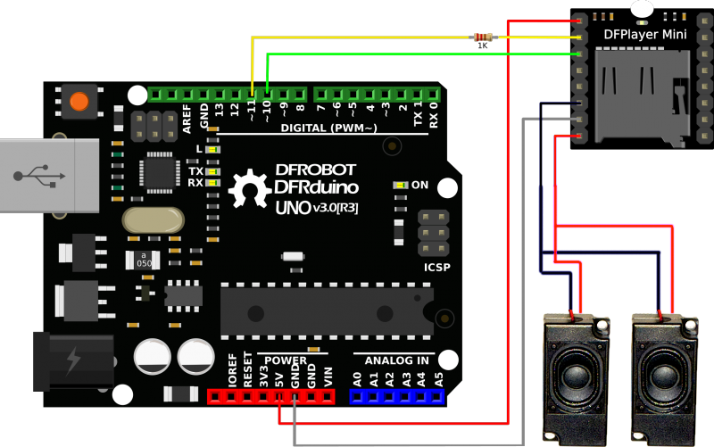

# DFPlayer Mini MP3 Player
This tutorial is made for NYUSH IMA community based on [DFROBOT DOCUMENTATION](https://wiki.dfrobot.com/DFPlayer_Mini_SKU_DFR0299).


## Introduction
The DFPlayer Mini MP3 Player For Arduino is a small and low cost MP3 module with an simplified output directly to the speaker. The module can be used as a stand alone module with attached battery, speaker and push buttons or used in combination with microcontrollers such as Arduino.

## Hardware


## Build the Circuit 



Note: The operating voltage of DFPlayer mini is 3.3 V, while most of the Arduino's operating voltage is 5 V. After our test, although it is possible to play music normally by directly connecting the Arduino directly to DFPlayer mini, there may be abnormal noises appearing. We recommend you to connect a 1k resistor in series with the RX pin of DFPlayer for voltage divider.


## Copy your mp3 into you micro SD card

NOTE: The order you copy the mp3 into micro SD card will affect the order mp3 played , which means play(1) function will play the first mp3 copied into micro SD card.

> [!CAUTION]
> For Mac User
> NOTE: If you are using Mac OS X to copy the mp3, the file system will automatically add hidden files like: "._0001.mp3" for index, which this module will handle as valid mp3 files. It is really annoying. You can use the windows computer in the studio, open the folder then you'll see the hidden files, delete the hidden files. 

## Arduino Code
We've created an Arduino library for DFPlayer Mini to simplify the method for you to make it work. Connect the hardware as the picture above shown and play with the sample code. You can search in your Arduino software or you can download the latest library here: [DFRobotDFPlayerMini](https://github.com/DFRobot/DFRobotDFPlayerMini/tree/master).


### Sample code "GetStarted", switching to next song every 3 seconds
```C++
#include "DFRobotDFPlayerMini.h"
#include <SoftwareSerial.h>

SoftwareSerial softSerial(10, 11);  //rx, tx
DFRobotDFPlayerMini myDFPlayer;

void setup() {

  Serial.begin(115200);
  softSerial.begin(9600);

  if (!myDFPlayer.begin(softSerial, /*isACK = */ false, /*doReset = */ false)) {  //Use serial to communicate with mp3.
    Serial.println("Error starting DFplayer");
  }
  myDFPlayer.volume(2);  //Set volume value. From 0 to 30
  myDFPlayer.play(1);     //Play the first mp3
}

void loop() {
  static unsigned long timer = millis();

  if (millis() - timer > 10000) { //switching to next song every 10 seconds
    timer = millis();
    myDFPlayer.next();
  }
}
```

