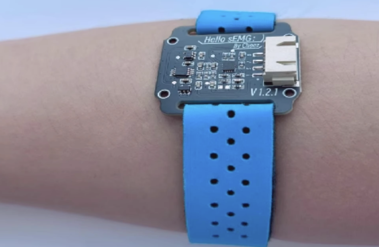

# EMG (Electromyography) Sensor or Muscle Sensor

Electromyography (EMG) is a technique that measures electrical activity in response to a nerve's stimulation of the muscle. 
This tutorial will showcase how to place this sensor in your forearm to detect the clenching of your fist to turn on the internal Arduino Uno LED in pin 13.
The EMG sensor works best as an ON/OFF sensor since achieving a large, usable analog range is quite challenging.

## Hardware

The EMG sensor has just four pins that need to be connected to the Arduino. 


The sensor contains 3 electrodes that need to be placed in direct contact with the skin for proper measuring. 
Open the strap and place if below your elbow. Close the strap firmly for optimal readings of your muscle activity.


### Circuit Setup

* 1 x Arduino Uno
* 4 x Jumper Wires
* 1 x EMG sensor


 

1. Connect the EMG sesnor as showcased on the diagram above.
2. Place the sensor firmly on your forearm.


## Code
Upload the code to your board and see how the internal Arduino LED lights up when you flex your fist. 
Modify the EMG_THRESHOLD value on line 6 depending on the sensivity you want to achieve. Lower value -> more sensitive, Higher value -> Less sensitive.

```C++
#define SAMPLE_RATE 500        // Sampling rate
#define INPUT_PIN A0           // Signal input
#define DETECT_PIN 2           // Detection input
#define LED_PIN 13             // Internal LED pin
#define Vref (1.65 / 5 * 1024) // Voltage offset
#define EMG_THRESHOLD 20       // Threshold for EMG activation
#define BUFFER_SIZE 128           // Window size
int circular_buffer[BUFFER_SIZE]; // Circular array
int data_index, sum;              // Data index

void setup() {
  Serial.begin(115200);
  pinMode(DETECT_PIN, INPUT); // Set DETECT_PIN as input mode
  pinMode(LED_PIN, OUTPUT);   // Set LED_PIN as output mode
  digitalWrite(LED_PIN, LOW); // Ensure the LED is off initially
}

void loop() {
  // Calculate elapsed time
  static unsigned long past = 0;
  unsigned long present = micros();
  unsigned long interval = present - past;
  past = present;

  static long timer = 0;
  timer -= interval; 

  if (timer < 0) {
    timer += 1000000 / SAMPLE_RATE;
    int sensor_value = analogRead(INPUT_PIN);
    int detect_value = digitalRead(DETECT_PIN); // Read digital signal from DETECT_PIN
    int signal = Filter(sensor_value);
    int envelop = getEnvelop(abs(signal));
    int emgRaw = sensor_value - Vref;

    // Trigger LED based on EMG activity
    if (envelop > EMG_THRESHOLD) {
      digitalWrite(LED_PIN, HIGH); // Turn on LED
    } else {
      digitalWrite(LED_PIN, LOW); // Turn off LED
    }

    // Output data via Serial
    if (detect_value == HIGH) {
      Serial.println(String(emgRaw) + "," +
                     String(envelop) + ",1");
    } else {
      Serial.println(String(emgRaw) + ",0,0");
    }
  }
}

// Envelope detection: Average of BUFFER_SIZE data points
int getEnvelop(int abs_emg) {
  sum -= circular_buffer[data_index];
  sum += abs_emg;
  circular_buffer[data_index] = abs_emg;
  data_index = (data_index + 1) % BUFFER_SIZE;
  return (sum / BUFFER_SIZE) * 2;
}

/**************************** Filtering
 * Generated by software ************************************/

// >>> Butterworth IIR Digital Filter: bandpass
//  Sampling Rate:500.0 Hz ,Frequency:[70.0, 110.0] Hz
//  Order: 4.0 ,implemented as second-order sections (biquads)
float Filter(float input) {
  float output = input;
  {
    static float z1, z2; // filter section state
    float x = output - (-0.55195385 * z1) - (0.60461714 * z2);
    output = 0.00223489 * x + (0.00446978 * z1) + (0.00223489 * z2);
    z2 = z1;
    z1 = x;
  }

  {
    static float z1, z2; // filter section state
    float x = output - (-0.86036562 * z1) - (0.63511954 * z2);
    output = 1.00000000 * x + (2.00000000 * z1) + (1.00000000 * z2);
    z2 = z1;
    z1 = x;
  }

  {
    static float z1, z2; // filter section state
    float x = output - (-0.37367240 * z1) - (0.81248708 * z2);
    output = 1.00000000 * x + (-2.00000000 * z1) + (1.00000000 * z2);
    z2 = z1;
    z1 = x;
  }

  {
    static float z1, z2; // filter section state
    float x = output - (-1.15601175 * z1) - (0.84761589 * z2);
    output = 1.00000000 * x + (-2.00000000 * z1) + (1.00000000 * z2);
    z2 = z1;
    z1 = x;
  }

  return output;
}


```


