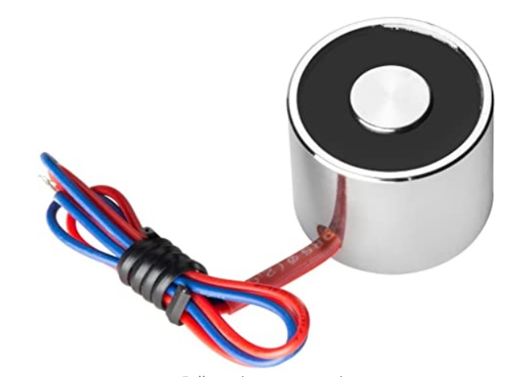
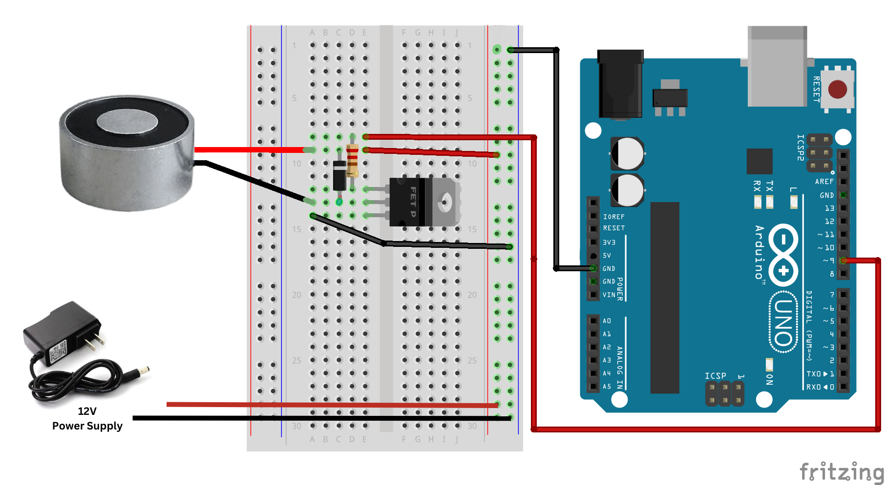

# Electromagnet

An **Electromagnet** is constructed by winding a coil around a conductive core object and applying a voltage across the terminals of the coil. This will form a magnetic field around the structure and make it act just like a magnet that can be used for so many applications (buzzers, relays, picking up stuff, coil guns, valves, MRI machines, and much more).

## Hardware


Here are the main specs of an electromagnet that you should be looking for carefully:

- **Rated Voltage**: usually it’s **5-12v**
- **Rated Current**: this is the current drawn by the Electromagnet when you apply the rated voltage
- **Lifting Force**: this represents the pulling force of the electromagnet when it’s activated, it can be anything from 1kg to 100kg or even more. Our Electromagnets have a lifting force of 3kg.

_***NOTE: this Electromagnet module has a noticeable **Residual Magnetism** effect which makes it tricky to work with, especially when you’re planning to use it to life (small light-weight objects). What you’re going to notice is that even when you turn it OFF, the small objects will still be sticking to the turned OFF Electromagnet. It’ll require a tiny external force to pull them apart, unless the object is relatively heavy, only then gravity will do the job.***_

## Circuit Diagram
Similar to the Solenoid tutorial,  in this tutorial, we are going to switch an electromagnet on and off in intervals of 1 second. You will need the following components for this tutorial:

- 1 x Arduino Uno
- 1 x Solderless breadboard
- 5 x Jumper Wires
- 1 x 12V Power Supply
- 1 x 220 Ω Resistor
- 1 x [Diode](https://core-electronics.com.au/1n4001-diode-10-pack.html)
- 1 x [Power Transistor](https://core-electronics.com.au/tip120-power-darlington-transistors-3-pack.html)
- **1 x Electromagnet**
  


1. Connect the 12v Power Supply to the power and ground rails on your breadboard. Connect the ground rail to your Arduino. 
2. Connect your electromagnet to separate lines on your breadboard, one to the power from step 2, the other needs to connect to the collector (middle) of the transistor.
3. Connect your Diode between the two electromagnet cables, this will prevent current from discharging back through the circuit when the solenoid coil discharges.
4. Insert your power transistor on three separate lines of your breadboard, with the flat side facing toward the outside. Ensure the collector's leg is connected to the electromagnet and diode line.
5. Connect a 220-ohm Resistor from the base leg of the transistor to a separate line
6. Connect the emitter leg to the ground rail.
7. Connect the other side of the resistor from step 6 to digital pin 9, that's our control pin.

## Code

```C++
int electroMagnetPin = 9;                    //This is the output pin on the Arduino uno

void setup(){
  pinMode(electroMagnetPin, OUTPUT);          //Sets that pin as an output
}

void loop(){
  digitalWrite(electroMagnetPin, HIGH);      //Switch Electromagnet ON
  delay(1000);                          //Wait 1 Second
  digitalWrite(electroMagnetPin, LOW);       //Switch Electromagnet OFF
  delay(1000);                          //Wait 1 Second
}
```

Upload the code to your board. Your electromagnet should be toggling on and off. Remember to test with heavy object to see the results, as an object that is too light may remain stuck to the electromagnet even when it is turned off. 
