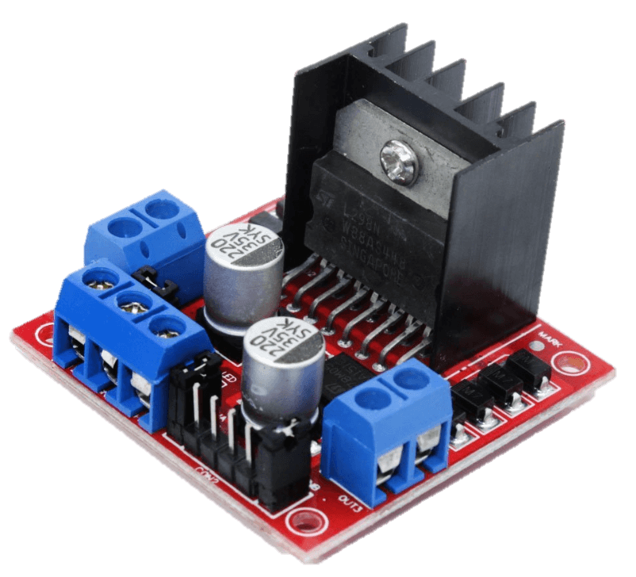
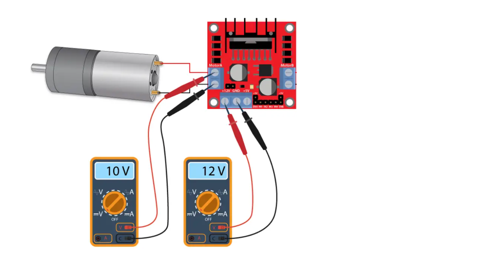
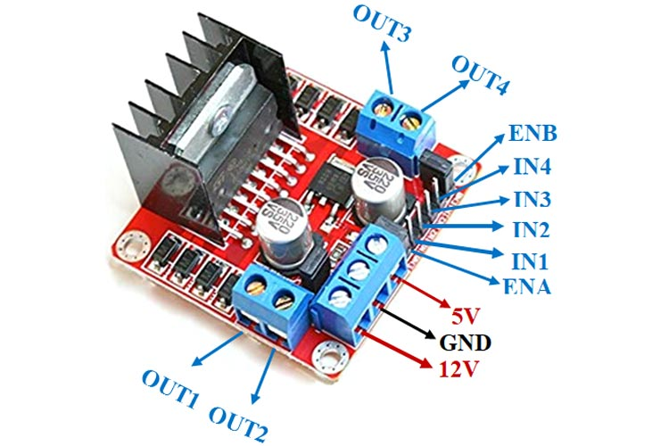
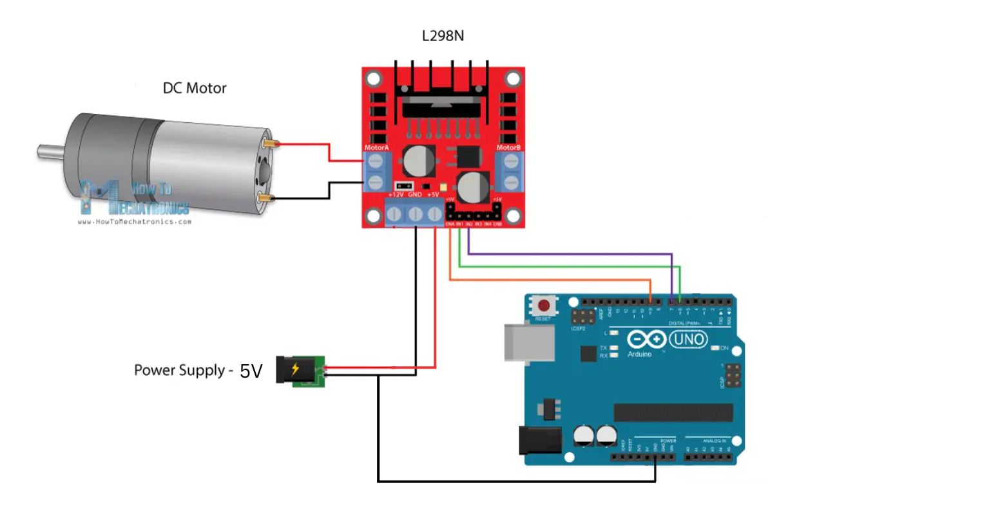

# H Bridge L298N Motor Driver

In this tutorial, we will learn how to control the rotation direction of a DC motor using the L298N motor driver. 

The L298N is a dual H-Bridge motor driver which allows speed and direction control of two DC motors at the same time. The module can drive DC motors that have voltages between 5 and 35V, with a peak current up to 2A. In this example, we will control one 5V DC motor.



## Technical Specifications


| | |
| - | - |
| Motor output voltage | 5V – 35V |
| Motor output voltage (Recommended) | 7V – 12V |
| Logic input voltage | 5V – 7V |
| Continuous current per channel | 2A |
| Max Power Dissipation | 25W|

**Voltage Drop of L298N**



The L298N has a voltage drop of approximately 2V. This is because internal switching transistors have a voltage drop of approximately 1V when forward biased and because an H-Bridge requires the current to pass through two transistors, the total voltage drop is 2V.

So, if you connect 12V to the motor power supply terminal, the motors will receive approximately 10V. This means that a 12V DC motor will never spin at full speed.

To get the motor to run at its maximum speed, the motor power supply should have a slightly higher voltage (+2V) than the actual voltage requirement of the motor.

Taking into account a voltage drop of 2V, if you are using 5V motors, you will need to provide 7V at the motor power supply terminal. If you have 12V motors then your motor supply voltage should be 14V.

For this example, we will still use a 5V power supply, even though the 5V DC will not spin at a slightly lower RPM. But that’s okay.

## Hardware
Let’s take a closer look at the pinout of the L298N module and explain how it works. 



The L298N module has 11 pins that allow it to communicate with the outside world. It has two screw terminal blocks for the motor A and B, and another screw terminal block for the Ground pin, the VCC for the motor, and a 5V pin which can either be an input or output.

Next are the logic control inputs. The Enable A and Enable B pins are used to enable and control the motor's speed. If a jumper is present on this pin, the motor will be enabled and work at maximum speed, and if we remove the jumper, we can connect a PWM input to this pin and control the motor's speed. If we connect this pin to a Ground the motor will be disabled.

Next, the Input 1 and Input 2 pins are used for controlling the rotation direction of motor A, and inputs 3 and 4 for motor B. Using these pins we control the switches of the H-Bridge inside the L298N IC. If input 1 is LOW and input 2 is HIGH the motor will move forward, and vice versa, if input 1 is HIGH and input 2 is LOW the motor will move backward. In case both inputs are the same, either LOW or HIGH the motor will stop. The same applies for the inputs 3 and 4 and the motor B.

## Wiring an L298N Motor Driver Module to an Arduino

Let’s begin by connecting the motor power supply. In our experiment, we are using one DC gearbox motor, also called “TT” motor, which are often found in two-wheel-drive robots. They are rated for 3 to 12V. Today we will connect an external 5V power source to the VCC terminal. Because L298N has a voltage drop of about 2V, the motors will receive 3V and spin at a slightly lower RPM. 

Now connect the L298N module’s Input and Enable pins (IN1, IN2, ENA,) to the Arduino digital output pins (6, 7, 9). Note that Arduino output pin 9 is PWM-enabled.

Finally, wire your DC motor to terminal A (OUT1 and OUT2). You can swap out your motor’s connections. There is technically no right or wrong way.

## Arduino Example Code
The sketch below will show you how to control the speed and spinning direction of a DC motor using the L298N Motor Driver and can serve as the basis for more practical experiments and projects.

The sketch moves the motor in one direction for one revolution, then in the opposite direction. There is also some acceleration and deceleration involved.

```C++
// Motor A connections
int enA = 9;
int in1 = 6;
int in2 = 7;


void setup() {
	// Set all the motor control pins to outputs
	pinMode(enA, OUTPUT);
	pinMode(in1, OUTPUT);
	pinMode(in2, OUTPUT);


	// Turn off motors - Initial state
	digitalWrite(in1, LOW);
	digitalWrite(in2, LOW);
	
}

void loop() {
	directionControl();
	delay(1000);
	speedControl();
	delay(1000);
}

// This function lets you control spinning direction of motors
void directionControl() {
	// Set motors to maximum speed
	// For PWM maximum possible values are 0 to 255
	analogWrite(enA, 255);

	// Turn on motor A
	digitalWrite(in1, HIGH);
	digitalWrite(in2, LOW);
	
	delay(2000);

	// Now change motor direction
	digitalWrite(in1, LOW);
	digitalWrite(in2, HIGH);

	delay(2000);

	// Turn off motor
	digitalWrite(in1, LOW);
	digitalWrite(in2, LOW);
	
}

// This function lets you control speed of the motor
void speedControl() {
	// Turn on motors
	digitalWrite(in1, LOW);
	digitalWrite(in2, HIGH);
	

	// Accelerate from zero to maximum speed
	for (int i = 0; i < 256; i++) {
		analogWrite(enA, i);

		delay(20);
	}

	// Decelerate from maximum speed to zero
	for (int i = 255; i >= 0; --i) {
		analogWrite(enA, i);

		delay(20);
	}

	// Now turn off motor
	digitalWrite(in1, LOW);
	digitalWrite(in2, LOW);
	
}
```

##Explanation
The Arduino code is fairly simple. It does not require any libraries to work. The sketch starts by declaring the Arduino pins that are connected to the L298N’s control pins.

In the setup section of the code, all of the motor control pins, including the direction and speed control pins, are configured as digital OUTPUT. And the direction control pins are pulled LOW to initially disable both motors.

In the loop section of the code, we call two user-defined functions with a one-second delay.

These functions are:

- `directionControl()` – This function causes the motor to spin at full speed for two seconds. It then reverses the spinning direction of the motor and spins for two seconds. Finally, it stops the motors.
- `speedControl()` – This function uses the [analogWrite()](https://www.arduino.cc/reference/en/language/functions/analog-io/analogwrite/) function to generate a PWM signal that accelerates the motor from zero to maximum speed before decelerating it back to zero. Finally, it stops the motor.

