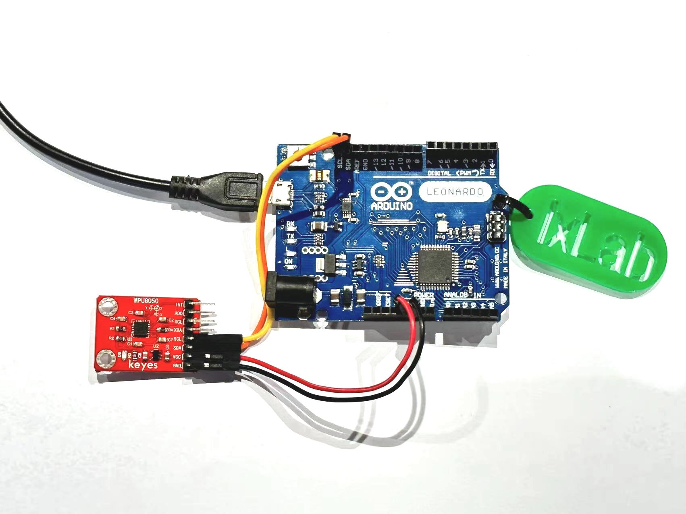

# IMU (Inertial measurement unit) - MPU6050

The MPU6050 is an inertial measurement unit that calculates three-axis accelerometer and three-axis gyroscope data.

The first example code shows you how to use the MPU6050 in Arduino only and prints the Pitch, Yaw and Roll data in degrees(°) in the serial monitor.

The second example code show how to use the MPU6050 paired with an Arduino Leonardo to control the mouse cursor from your laptop.


## Hardware


Here are some common IMU specifications:

<u>Gyroscope </u> – The gyroscope measures rotational velocity or rate of change of the angular position over time, along the X, Y and Z axis. 

<u>Accelerometer </u> – The accelerometer can measure both static and dynamic forces of acceleration, along the X, Y and Z axis. The earth gravitational force is a typical example of static force, while dynamic forces can be caused by vibrations, movements and so on.


### Circuit Setup

* 1 x Arduino Leonardo
* 4 x Jumper Wires (M/F)
* 1 x MPU 6050

 


|MPU6050    | Arduino        | 
| ------------- |:-------------:| 
| GND     | GND | 
| VCC     | 5V     |   
| SDA |  SDA   | 
| SCL | SCL      | 


## Example Code 1 - Pitch, Yaw and Roll in Arduino

**Note:**
To run this code, you will need to install the following libraries in your library manager:
- Adafruit MPU6050 by adafruit
- Adafruit Unified Sensor
- Adafruit Bus IO 


```C++
#include <Adafruit_MPU6050.h>
#include <Adafruit_Sensor.h>
#include <Wire.h>

Adafruit_MPU6050 mpu;

float pitch = 0.0;
float roll = 0.0;
float yaw = 0.0;

unsigned long lastTime = 0;

void setup(void) {
  Serial.begin(115200);

  if (!mpu.begin()) {
    Serial.println("Failed to find MPU6050 chip");
    while (1) {
      delay(10);
    }
  }
  Serial.println("MPU6050 Found!");
  mpu.setAccelerometerRange(MPU6050_RANGE_8_G);
  mpu.setGyroRange(MPU6050_RANGE_500_DEG);
  mpu.setFilterBandwidth(MPU6050_BAND_21_HZ);

  delay(100);
  lastTime = millis();
}

void loop() {
  sensors_event_t a, g, temp;
  mpu.getEvent(&a, &g, &temp);

  unsigned long currentTime = millis();
  float dt = (currentTime - lastTime) / 1000.0; 
  lastTime = currentTime;

  // Calculate accelerometer angles (in degrees)
  float accelPitch = atan2(a.acceleration.y, sqrt(a.acceleration.x * a.acceleration.x + a.acceleration.z * a.acceleration.z)) * 180 / PI;
  float accelRoll = atan2(-a.acceleration.x, a.acceleration.z) * 180 / PI;

  // Integrate gyroscope data (convert rad/s to deg/s)
  float gyroPitchRate = g.gyro.x * 180 / PI;
  float gyroRollRate = g.gyro.y * 180 / PI;
  float gyroYawRate = g.gyro.z * 180 / PI;

  // Complementary filter
  const float alpha = 0.98; 
  pitch = alpha * (pitch + gyroPitchRate * dt) + (1 - alpha) * accelPitch;
  roll = alpha * (roll + gyroRollRate * dt) + (1 - alpha) * accelRoll;
  yaw += gyroYawRate * dt; 

  // --- Print values ---
  Serial.print("Pitch: ");
  Serial.print(pitch);
  Serial.print("°, Roll: ");
  Serial.print(roll);
  Serial.print("°, Yaw: ");
  Serial.print(yaw);
  Serial.println("°");

  delay(100);
}


```


## Example Code 2 - MPU6050 paired with an Arduino Leonardo for controlling your mouse's laptop

**Note:**
To run this code, you will need to install the following libraries in your library manager:
- Adafruit MPU6050 by adafruit
- Adafruit Unified Sensor
- Adafruit Bus IO
- Mouse by Arduino
  
Upload the code to your board and see how the mouse on the screen moves according to the position of the IMU. 
Code reference from edwardthe found at hackster.io

```C++
#include <Wire.h>
#include <I2Cdev.h>
#include <MPU6050.h>
#include <Mouse.h>

MPU6050 mpu;
int16_t ax, ay, az, gx, gy, gz;
int vx, vy;

void setup() {
  Serial.begin(9600);
  Wire.begin();
  Mouse.begin();
  mpu.initialize();
  if (!mpu.testConnection()) {
    while (1);
  }
}

void loop() {
  mpu.getMotion6(&ax, &ay, &az, &gx, &gy, &gz);
  vx = (gx - 400) / 200; // "-400" because the x axis of gyroscope give values about -350 while it's not moving. Change this value if you get something different using the TEST code, chacking if there are values far from zero.
  vy = -(gz - 200) / 200; // same here about "-200"
  Mouse.move(vx, vy);
  delay(20);
}
```

