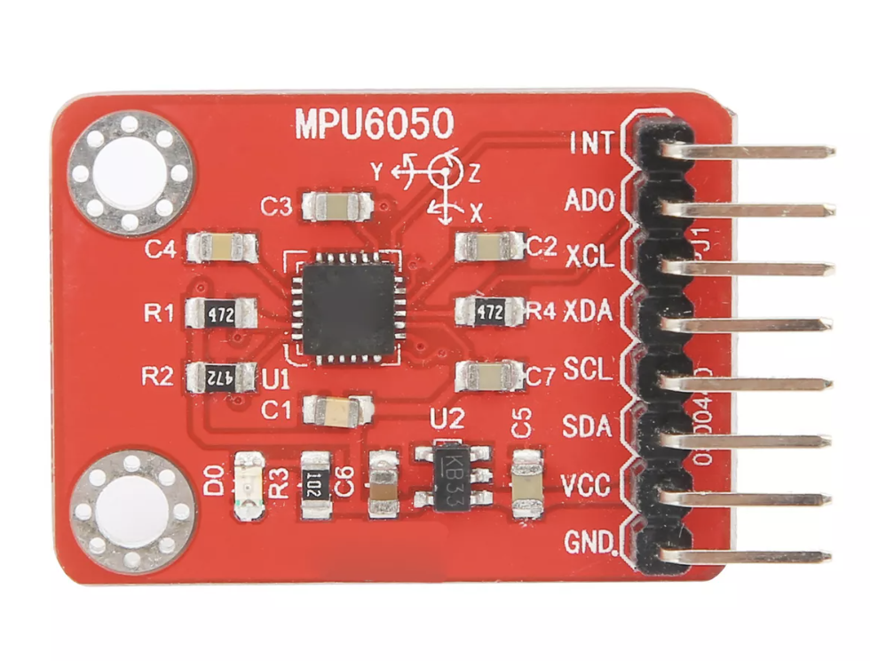

# IMU

In this tutorial we will learn how to use the MPU6050 paired with an Arduino Leonardo to control the mouse cursor from your laptop.
The MPU6050 is an IMU device that stands for Inertial Measurement Unit. It is a six-axis motion tracking device that calculates a three-axis accelerometer and three-axis gyroscope data.


## Hardware


Here are some common MPU  specifications:

<u>Gyroscope </u> – The gyroscope measures rotational velocity or rate of change of the angular position over time, along the X, Y and Z axis. 

<u>Accelerometer </u> – The accelerometer can measure both static and dynamic forces of acceleration, along the X, Y and Z axis. The earth gravitational force is a typical example of static force, while dynamic forces can be caused by vibrations, movements and so on.


### Circuit Setup
In this tutorial, we are going to switch a small 5v Solenoid on and off in intervals of 1 second. You will need the following components for this tutorial:

* 1 x Arduino Leonardo
* 4 x Jumper Wires (M/F)
* 1 x MPU 6050

 ![Image of MPU6050 Diagram]

1. Connect ..

## Code
Upload the code to your board and see how the mouse on the screen moves according to the position of the IMU. 
Code reference from edwardthe found a hackster.io

```C++
#include <Wire.h>
#include <I2Cdev.h>
#include <MPU6050.h>
#include <Mouse.h>

MPU6050 mpu;
int16_t ax, ay, az, gx, gy, gz;
int vx, vy;

void setup() {
  Serial.begin(9600);
  Wire.begin();
  Mouse.begin();
  mpu.initialize();
  if (!mpu.testConnection()) {
    while (1);
  }
}

void loop() {
  mpu.getMotion6(&ax, &ay, &az, &gx, &gy, &gz);
  vx = (gx - 400) / 200; // "-400" because the x axis of gyroscope give values about -350 while it's not moving. Change this value if you get something different using the TEST code, chacking if there are values far from zero.
  vy = -(gz - 200) / 200; // same here about "-200"
  Mouse.move(vx, vy);
  delay(20);
}
```

