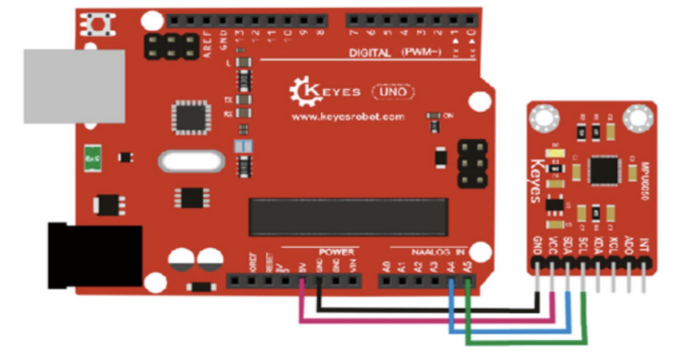
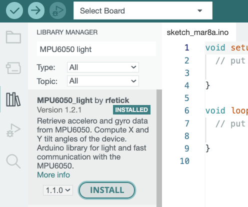
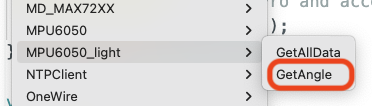
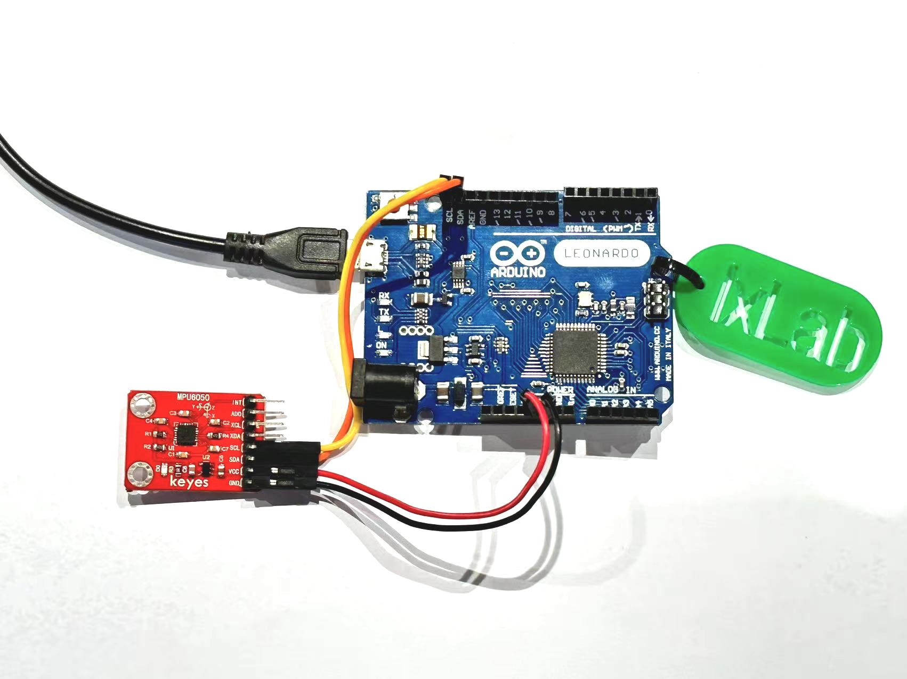

# IMU (Inertial measurement unit) - MPU6050

The MPU6050 is an inertial measurement unit that calculates three-axis accelerometer and three-axis gyroscope data.

**The first example** code shows you how to use the MPU6050 in Arduino using the library MPU6050_light by rfetick.

**The second example** code show how to use the MPU6050 paired with an Arduino Leonardo to control the mouse cursor from your laptop.


## Hardware

<u>Gyroscope </u> – The gyroscope measures rotational velocity or rate of change of the angular position over time, along the X, Y and Z axis. 

<u>Accelerometer </u> – The accelerometer can measure both static and dynamic forces of acceleration, along the X, Y and Z axis. The earth gravitational force is a typical example of static force, while dynamic forces can be caused by vibrations, movements and so on.


### Example 1 - Circuit Setup

* 1 x Arduino Uno
* 4 x Jumper Wires (M/F)
* 1 x MPU 6050




|MPU6050    | Arduino Uno        | 
| ------------- |:-------------:| 
| GND     | GND | 
| VCC     | 5V     |   
| SDA |  A4   | 
| SCL | A5      |

<br />
- Download the MPU6050_light library in your Arduino IDE first.

  
  Original source code:
https://github.com/rfetick/MPU6050_light  

- In your ArduinoIDE, go to File -> Examples -> MPU6050_Light -> Get Angle

  


 

```C++
/* Get tilt angles on X and Y, and rotation angle on Z
 * Angles are given in degrees
 * 
 * License: MIT
 */

#include "Wire.h"
#include <MPU6050_light.h>

MPU6050 mpu(Wire);
unsigned long timer = 0;

void setup() {
  Serial.begin(9600);
  Wire.begin();

  byte status = mpu.begin();
  Serial.print(F("MPU6050 status: "));
  Serial.println(status);
  while (status != 0) {}  // stop everything if could not connect to MPU6050

  Serial.println(F("Calculating offsets, do not move MPU6050"));
  delay(1000);
  // mpu.upsideDownMounting = true; // uncomment this line if the MPU6050 is mounted upside-down
  mpu.calcOffsets();  // gyro and accelero
  Serial.println("Done!\n");
}

void loop() {


  if ((millis() - timer) > 10) {  // print data every 10ms
    mpu.update();
    Serial.print("X : ");
    Serial.print(mpu.getAngleX());
    Serial.print("\tY : ");
    Serial.print(mpu.getAngleY());
    Serial.print("\tZ : ");
    Serial.println(mpu.getAngleZ());
    timer = millis();
  }
}
```
<br />
<br />
<br />
<br />
<br />


## Example Code 2 - MPU6050 paired with an Arduino Leonardo for controlling your mouse

 

|MPU6050    | Arduino Leonardo        | 
| ------------- |:-------------:| 
| GND     | GND | 
| VCC     | 5V     |   
| SDA |  SDA   | 
| SCL | SCL      | 


**Note:**
To run this code, you will need to install the following libraries in your library manager:
- Adafruit MPU6050 by adafruit
- Adafruit Unified Sensor
- Adafruit Bus IO
- Mouse by Arduino
  
Upload the code to your board and see how the mouse on the screen moves according to the position of the IMU. 
Code reference from edwardthe found at hackster.io

```C++
#include <Wire.h>
#include <I2Cdev.h>
#include <MPU6050.h>
#include <Mouse.h>

MPU6050 mpu;
int16_t ax, ay, az, gx, gy, gz;
int vx, vy;

void setup() {
  Serial.begin(9600);
  Wire.begin();
  Mouse.begin();
  mpu.initialize();
  if (!mpu.testConnection()) {
    while (1);
  }
}

void loop() {
  mpu.getMotion6(&ax, &ay, &az, &gx, &gy, &gz);
  vx = (gx - 400) / 200; // "-400" because the x axis of gyroscope give values about -350 while it's not moving. Change this value if you get something different using the TEST code, chacking if there are values far from zero.
  vy = -(gz - 200) / 200; // same here about "-200"
  Mouse.move(vx, vy);
  delay(20);
}
```

