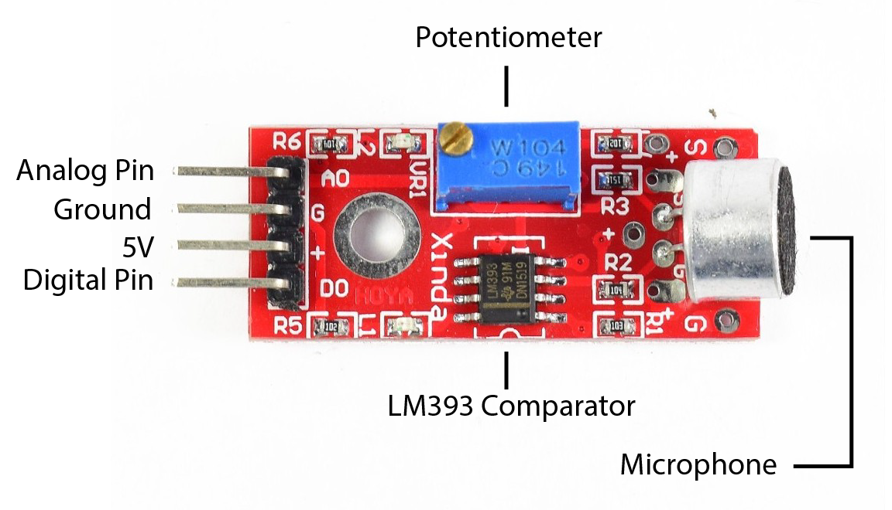

# Microphone Sensor

The microphone sensor has a microphone that converts sound to an electric signal. There are several different types of microphone sensors that have slight variation in functionality but for our tutorial we use the KY-038.

## Hardware

The KY-038 allows for both analog and digital input. It has a built-in potentiometer to allow you to adjust sensitivity and filter out ambient noise. This gives a base voltage value to the comparator, which compares that value to the incoming signal from the microphone, giving you a LOW or HIGH signal if the sound is below or above the set threshold. As the KY-038 has low analog gain, this sensor is not well-suited to be used as a standard microphone and requires fairly high sound volume to register signals. It's primarily used to detect single high amplitude events, such as a knock or clap.

## Circuit Setup


## Code

While the example code below registers both analog and digital input from the microphone sensor, please note that you can just use one or the other if you wish.

```C++
int digitalPin = 2;
int analogPin = A0;
int digitalInput;
int analogInput;

void setup() {
  Serial.begin(9600);
}

void loop() {
  digitalInput = digitalRead(digitalPin);
  analogInput = analogRead(analogPin);
  Serial.print("Digital Input: ");
  Serial.print(digitalInput);
  Serial.print(", ");
  Serial.print("Analog Input: ");
  Serial.println(analogInput);
  delay(50);
}
```

## Sensitivity Adjustment

Now that we have some basic readings printing to Serial. We should adjust the potentiometer on the sensor to get the best results. In order to lower the sensitivity, turn the screw on the potentiometer counter-clockwise. To increase the sensitivity, turn clockwise. There is a small built-in LED directly next to the potentiometer representing our input. In general, we want to adjust the potentiometer until we see this light flickering so if it is constantly at full brightness turn the sensitivity down, if it's constantly off, turn the sensitivity up. If you are using the digital input, take a look at the value printing in Serial to further fine tune the potentiometer. Do the action that you want to trigger the sensor (eg. a clap) and make sure that the value changes from LOW to HIGH. Be careful not to tune the sensitivity too high that it would give unwanted triggers though.
