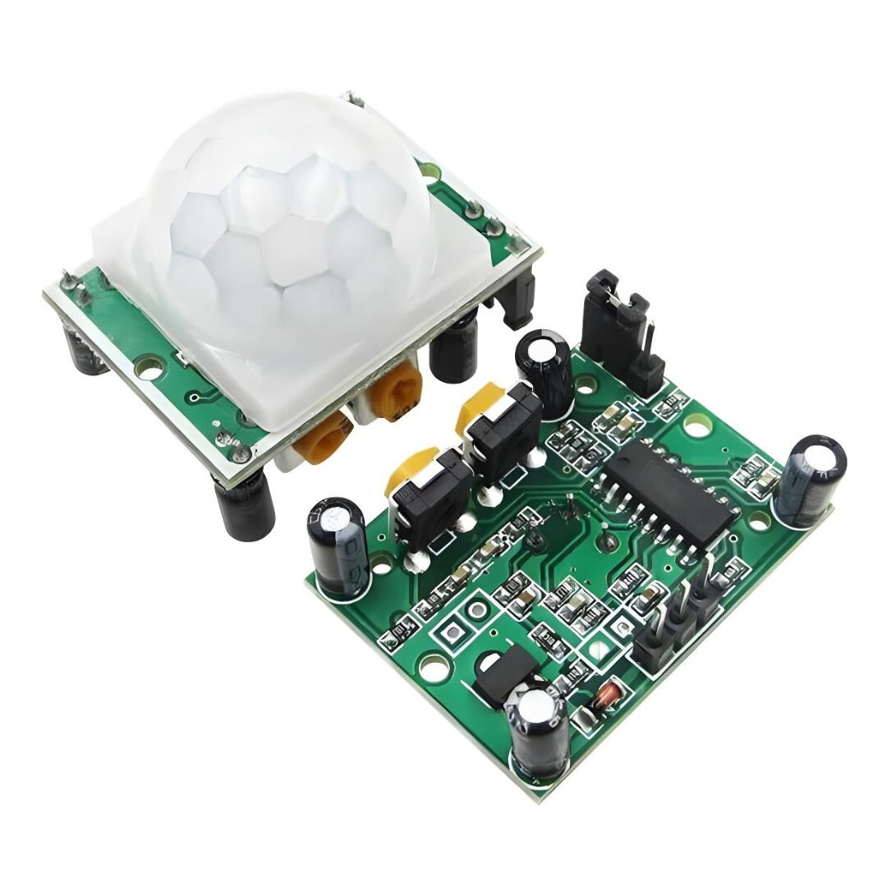
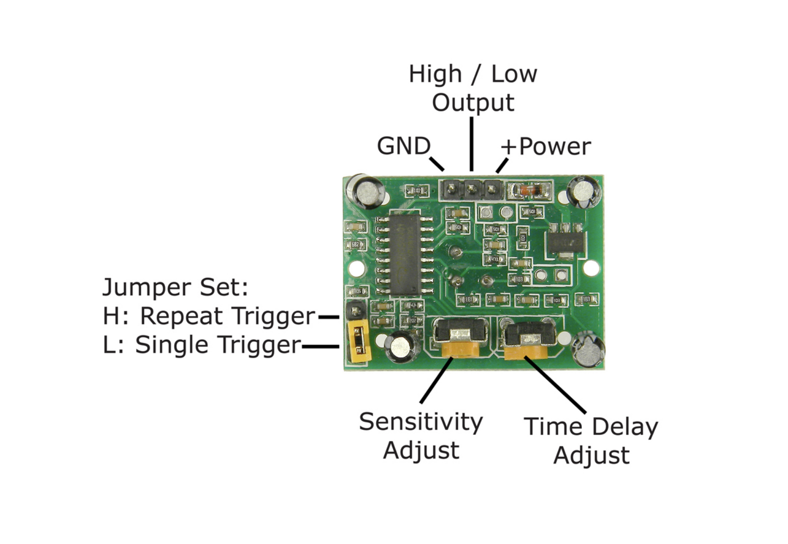
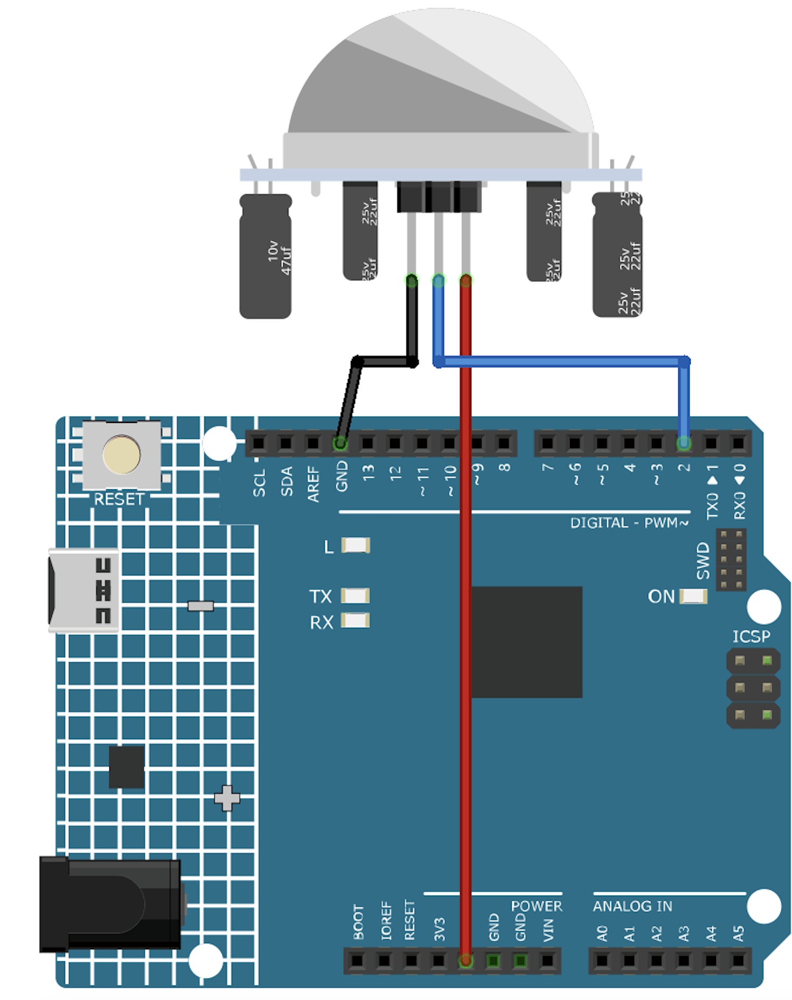

# Motion Sensors HC-SR501(PIR)
This tutorial is made for NYUSH IMA community based on [SunFounder Documentation](https://docs.sunfounder.com/projects/ultimate-sensor-kit/en/latest/components_basic/13-component_pir_motion.html).

## Introduction
The Passive Infrared(PIR) Motion Sensor is a sensor that detects motion. It is commonly used in security systems and automatic lighting systems. The sensor has two slots that detect infrared radiation. When an object, such as a person, passes in front of the sensor, it detects a change in the amount of infrared radiation and triggers an output signal.
## Hardware

### Distance Adjustment
Turning the knob of the distance adjustment potentiometer clockwise, the range of sensing distance increases, and the maximum sensing distance range is about 0-7 meters. If turn it anticlockwise, the range of sensing distance is reduced, and the minimum sensing distance range is about 0-3 meters.

### Delay adjustment
Rotate the knob of the delay adjustment potentiometer clockwise, you can also see the sensing delay increasing. The maximum of the sensing delay can reach up to 300s. On the contrary, if rotate it anticlockwise, you can shorten the delay with a minimum of 5s.

### Two Trigger Modes

Choosing different modes by using the jumper cap.

H: Repeatable trigger mode, after sensing the human body, the module outputs high level. During the subsequent delay period, if somebody enters the sensing range,the output will keep being the high level.

L: Single trigger mode, outputs high level when it senses the human body. After the delay, the output will change from high level into low level automatically.

## Instruction for Use

1. Sensor module is powered up after a minute, in this initialization time intervals during this module will output 0-3 times, a minute later enters
the standby state;

2. Should try to avoid the lights and other sources of interference close direct module surface of the lens, in order to avoid the introduction of
interference signal malfunction; environment should avoid the wind flow, the wind will cause interference on the sensor;

3. Sensor module with dual probe, the probe window is rectangular, dual (A B) in both ends of the longitudinal direction;

* so when the human body from left to right or right to left through the infrared spectrum to reach dual time, distance difference, the greater
the difference, the more sensitive the sensor;

* when the human body from the front to the probe or from top to bottom or from bottom to top on the direction traveled, double detects
changes in the distance of less than infrared spectroscopy, no difference value the sensor insensitive or does not work;

4. The dual direction of sensor should be installed parallel as far as possible in inline with human movement. In order to increase the sensor
angle range, the module using a circular lens also makes the probe surrounded induction, but the left and right sides still up and down in
both directions sensing range, sensitivity, still need to try to install the above requirements.

## Build the Circuit 

