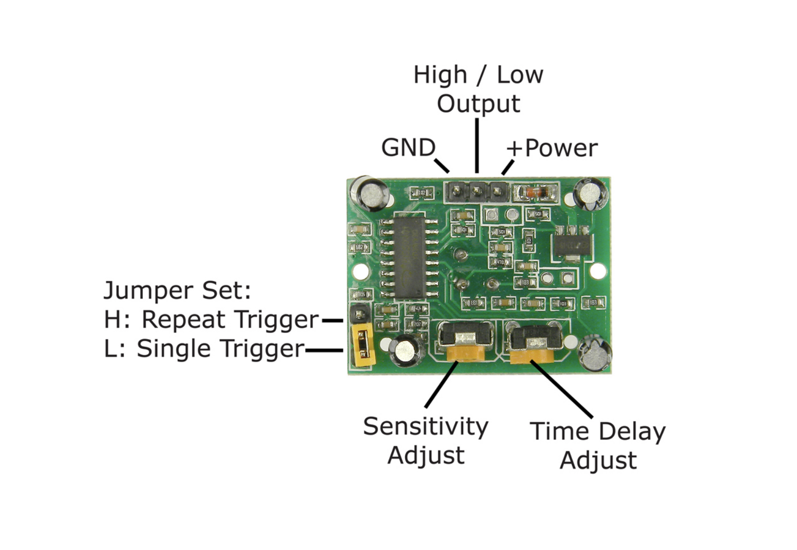

# Motion Sensors HC-SR501(PIR)
This tutorial is made for NYUSH IMA community based on [SunFounder Documentation](https://docs.sunfounder.com/projects/ultimate-sensor-kit/en/latest/components_basic/13-component_pir_motion.html).

## Introduction
The Passive Infrared(PIR) Motion Sensor is a sensor that detects motion. It is commonly used in security systems and automatic lighting systems. The sensor has two slots that detect infrared radiation. When an object, such as a person, passes in front of the sensor, it detects a change in the amount of infrared radiation and triggers an output signal.
## Structure
