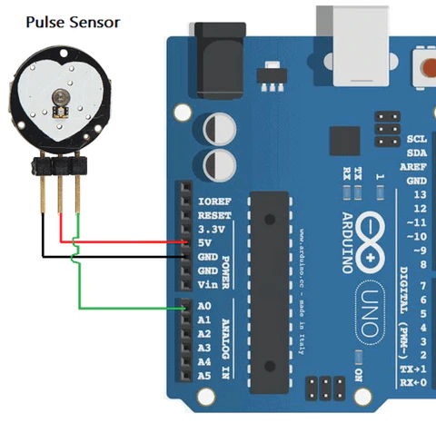

# Pulse Sensor
The pulse sensor is used to detect the user's pulse by shining a light through the skin to see changes in bloodflow. Because of how it operates, it can only be used in areas where light can easily penetrate, such as the finger or earlobe. To use it, simply press the sensor against your skin.

## Circuit Diagram


## Code
For this tutorial you will need the library [Pulse Sensor Playground](https://www.arduino.cc/reference/en/libraries/pulsesensor-playground/).

The code below will blink the builtin LED on your Arduino board according to your heartbeat and measures your heartrate's BPM.

```C++
#define USE_ARDUINO_INTERRUPTS true  // set-up low-level interrupts for most acurate BPM math.
#include <PulseSensorPlayground.h>

PulseSensorPlayground pulseSensor;
int bpm;

void setup() {   
  Serial.begin(9600);
  pulseSensor.analogInput(0);  //Pin setup, note that you do not need to lead the analog pin number with 'A'
  pulseSensor.blinkOnPulse(LED_BUILTIN);  //Blinks the LED on pulse
  pulseSensor.setThreshold(506);    //Threshold to detect a pulse. Keeping it between 500-550 is recommended,
                                    //lowering the value will make it more sensitive (may detect 'false' pulses),
                                    //raising the value will make it less sensitive (may miss 'real' pulses).
  pulseSensor.begin();
}

void loop() {
  bpm = pulseSensor.getBeatsPerMinute();
  Serial.println(bpm);
  delay(50);
}
```
The Pulse Sensor Playground library contains additional functions that may be useful for your projects. Take a look at their documentation or example sketches to see them.


## Additional Information

If you plan to use the pulse sensor with servos, be sure to install/update to `v2.1.1` and above of the Pulse Sensor Playground library. Some older versions may be incompatible with the Servo library on AVR boards (Uno, Mega, etc).
