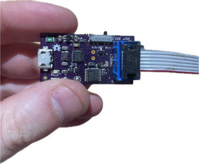
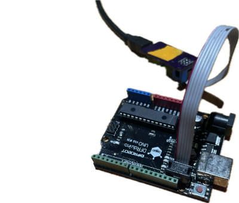
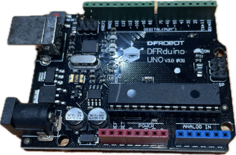

# Reprogramming Arduino USB VID

## Objective

The Arduino Uno boards from DF Robot come programmed with a USB Vendor ID (VID) set to `0x3343`, which the Arduino IDE 2.x doesn't automatically detect.

This tutorial shows how to re-programm the ATmega16U2 chip on the Arduino to report Arduino's Vendor ID `0x2341` instead. A special programming device is needed to accompish this.

## Step 1

Get the ISP programmer board (USB μISP) from gohai, and set the switch to supply 5V.



## Step 2

Connect it to the Arduino board like so:



## Step 3

Download the file `Arduino-COMBINED-dfu-usbserial-atmega16u2-Uno-Rev3.hex` [from GitHub](https://github.com/arduino/ArduinoCore-avr/blob/master/firmwares/atmegaxxu2/Arduino-COMBINED-dfu-usbserial-atmega16u2-Uno-Rev3.hex)

You also need the `avrdude` program, which on macOS you can install (via [Homebrew](https://brew.sh/)) with: `brew install avrdude`.

## Step 4

In the program you downloaded the `.hex` file to, run the following command:

```
avrdude -c usbtiny -p m16u2 -U flash:w:Arduino-COMBINED-dfu-usbserial-atmega16u2-Uno-Rev3.hex -V
```

This should display a message like this, if successful:

```
avrdude: AVR device initialized and ready to accept instructions
avrdude: device signature = 0x1e9489 (probably m16u2)
avrdude: Note: flash memory has been specified, an erase cycle will be performed.
         To disable this feature, specify the -D option.
avrdude: erasing chip

avrdude: processing -U flash:w:Arduino-COMBINED-dfu-usbserial-atmega16u2-Uno-Rev3.hex:i
avrdude: reading input file Arduino-COMBINED-dfu-usbserial-atmega16u2-Uno-Rev3.hex for flash
         with 7414 bytes in 2 sections within [0, 0x3d33]
         using 59 pages and 138 pad bytes
avrdude: writing 7414 bytes flash ...
Writing | ################################################## | 100% 12.26 s
avrdude: 7414 bytes of flash written

avrdude done.  Thank you.
```

## Step 5

We added a small white dot with a paint marker to indicate that the board has been modified:


