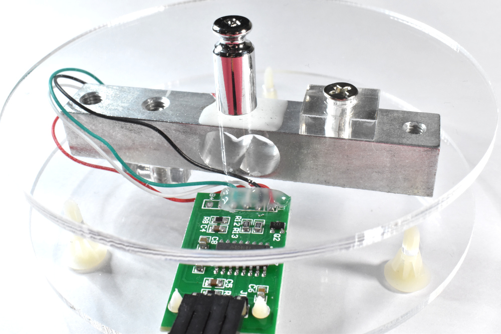
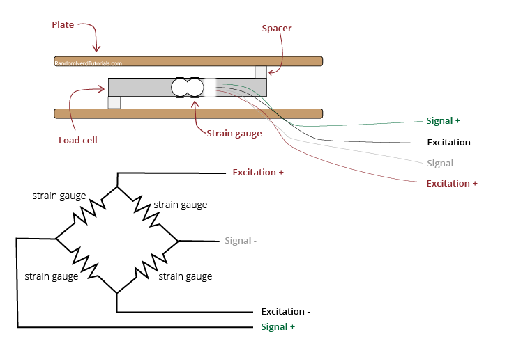
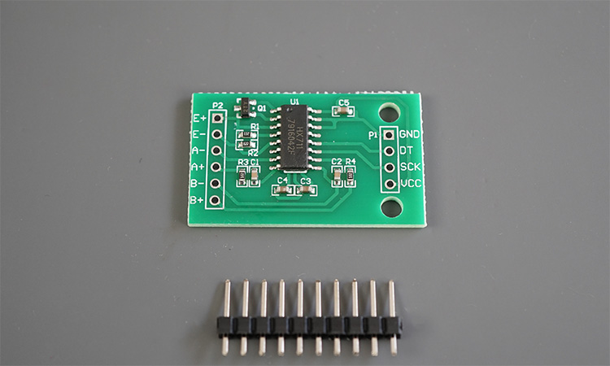
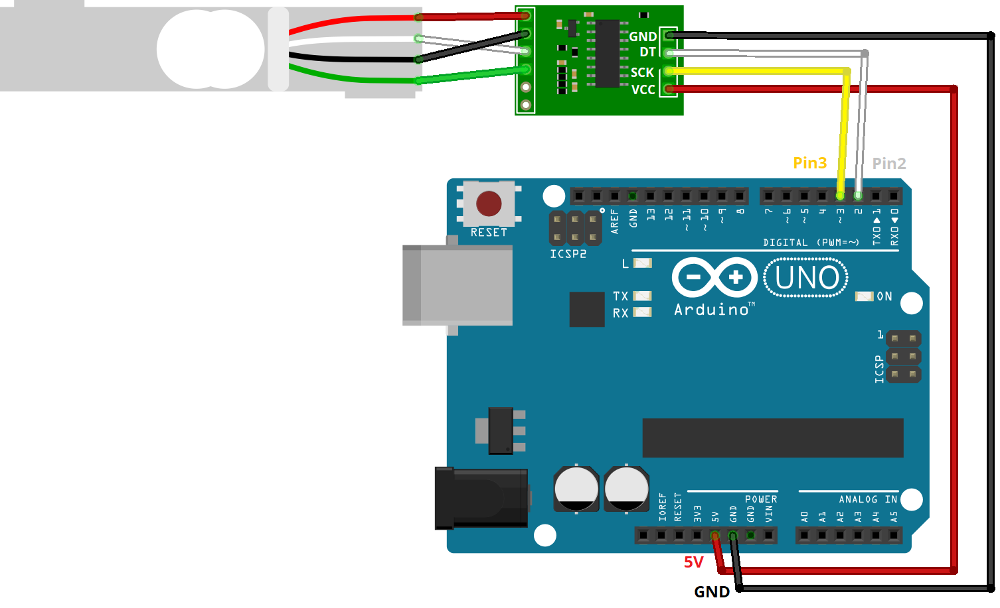

## Digital Scale (Load Cell and HX711 Amplifier)

In this tutorial, we will learn how to wire the Load Cell and HX711 Amplifier, which work as a digital scale. 



## Load Cell


A load cell converts a force into an electrical signal that can be measured. The electrical signal changes proportionally to the force applied. There are different types of load cells: strain gauges, pneumatic, and hydraulic. This tutorial uses strain gauge load cells. 

Strain gauge load cells are composed of a metal bar with attached strain gauges (under the white glue in the picture above). A strain gauge is an electrical sensor that measures force or strain on an object. The resistance of the strain gauges varies when an external force is applied to an object, which results in a deformation of the object’s shape (in this case, the metal bar). The strain gauge resistance is proportional to the load applied, which allows us to calculate the weight of objects.

Usually, load cells have four strain gauges hooked up in a Wheatstone bridge (as shown below) that allow us to get accurate resistance measurements. For a more detailed explanation of how strain gauges work, [read this article](https://www.allaboutcircuits.com/textbook/direct-current/chpt-9/strain-gauges/).



### Applications
Applications

Strain gauge load cells can be used in a wide variety of applications. For example:

* check if an object’s weight changes over time;
* measure the weight of an object;
* detect the presence of an object;
* estimate a container’s liquid level;
* etc.

Because the changes in strain when weighting objects are so small, we need an amplifier. The load cell we’re using is usually sold together with an HX711 amplifier. So, that’s the amplifier we’ll use.

## HX711 Amplifier



The HX711 amplifier is a breakout board that allows you to easily read load cells to measure weight. You wire the load cell wires on one side, and the microcontroller on the other side. The HX711 communicates with the microcontroller using two-wire interface (Clock and Data).

## Wiring Load Cell and HX711 Amplifier to the Arduino

The HX711 amplifier communicates via two-wire interface. You can connect it to any digital pins of your Arduino board. We’re connecting the data pin (DT) to Pin 2 and the clock pin (CLK) to Pin 3.



## Installing the HX711 Library
There are several different libraries to get measurements from a load cell using the HX711 amplifier. We’ll use the [HX711 library by bodge](https://github.com/bogde/HX711). It is compatible with the ESP32, ESP8266, and Arduino.

To install the library,
    1. Open Arduino IDE and go to **Sketch** > **Include Library** > **Manage Libraries**.
    2. Search for “**HX711 Arduino Library**” and install the library by Bogdan Necula.
    
## Calibrating the Scale
Upload the following code to your board. Then open the **Serial Monitor at a baud rate of 57600** and see the results.

``` C++
/*
  Rui Santos
  Complete project details at https://RandomNerdTutorials.com/arduino-load-cell-hx711/
  
  Permission is hereby granted, free of charge, to any person obtaining a copy
  of this software and associated documentation files.
  
  The above copyright notice and this permission notice shall be included in all
  copies or substantial portions of the Software.
*/

// Calibrating the load cell
#include "HX711.h"

// HX711 circuit wiring
const int LOADCELL_DOUT_PIN = 2;
const int LOADCELL_SCK_PIN = 3;

HX711 scale;

void setup() {
  Serial.begin(57600);
  scale.begin(LOADCELL_DOUT_PIN, LOADCELL_SCK_PIN);
}

void loop() {

  if (scale.is_ready()) {
    scale.set_scale();    
    Serial.println("Tare... remove any weights from the scale.");
    delay(5000);
    scale.tare();
    Serial.println("Tare done...");
    Serial.print("Place a known weight on the scale...");
    delay(5000);
    long reading = scale.get_units(10);
    Serial.print("Result: ");
    Serial.println(reading);
  } 
  else {
    Serial.println("HX711 not found.");
  }
  delay(1000);
}
```

Calculate your calibration factor using the formula: 
```
calibration factor = (reading)/(known weight)
```

Add the calibration factor like this: scale.set_scale(INSERT YOUR CALIBRATION FACTOR);


