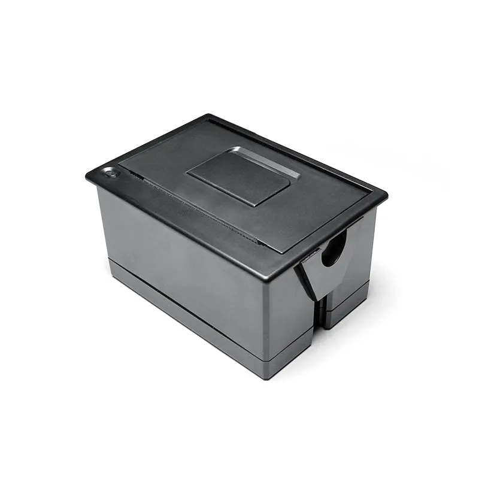
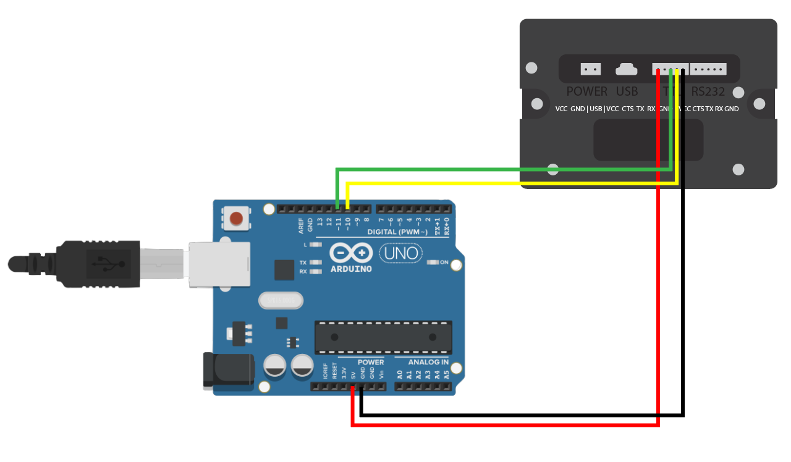

# Thermal Printer
Thermal printers use heat in order to print onto a specialized paper. This is commonly seen in the form of a receipt printer.

## Hardware

The printer we have on hand is a EM5822. It can use either TTL or RS232 to communicate instructions to it and takes ESC/POC commands for formatting.



### Specifications
| | |
| - | - |
| Operating Voltage | 5-9V |
| Pinout | VCC CTS TX RX GND |
## Setup

TTL requires a lower voltage (3.3V-5V) which makes it pair nicely with microcontrollers. RS232 is generally more versatile, being less susceptible to noise, interference, and degradation, but requires a higher voltage of around 13V. Since the purpose of this tutorial is to show how to use the printer with the Arduino Uno in your kit, we will be using TTL.



## Code
To ensure we don't print any unwanted messages, we use **SoftwareSerial** to control the printer instead of hardware serial. This allows us to use digital pins as RX/TX pins. As stated before, the printer takes [ESC/POC Commands](https://escpos.readthedocs.io/en/latest/font_cmds.html), allowing you to change text style and other print options.

Below is an simple example that prints "Hello World!" once in **bold**. You can find other styling/formatting commands from the link above.

```C++
#include <SoftwareSerial.h>

SoftwareSerial ser(10, 11); //RX,TX pins

void setup() {
  ser.begin(9600); //begin software serial
  delay(1000); //1 second delay to prevent double printing
  ser.print("\x1B\x21\x08"); //format text to be bold
  ser.println("Hello World!");
  ser.println();
}

void loop() {
}
```
