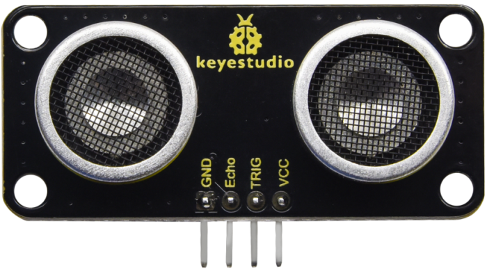
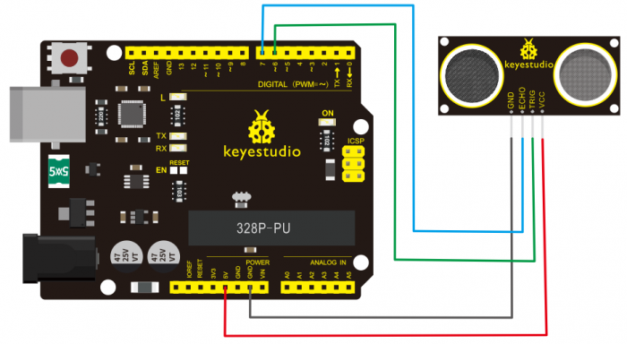

# Ultrasonic Distance Sensor
The ultrasonic distance sensor detects distance by sending an ultrasonic wave from one side and calculating the time it takes for it to bounce back to the receiver.
## Hardware
For this tutorial we will be using the Arduino Uno and Keyestudio SR01 Ultrasonic sensors that you can find in your kits.



Here are some useful specifications on the ultrasonic sensor:
| | |
| - | - |
| Operating Voltage | DC 3.3V-5V |
| Size | 49mm * 22mm * 19mm |
| Min Range | <4cm |
| Max Range | 3M |
| Measuring Angle | <15 Degrees |
| Holes Diamater | 3mm |

### Circuit Setup



## Code

Below is some starting code, which will allow you to read the distance in centimeters.

```C++
int triggerPin = 6;
int echoPin = 7;
long distance;

void setup() {
  Serial.begin(9600);
  pinMode(triggerPin, OUTPUT);
  pinMode(echoPin, INPUT);
}

void loop() {
  // additional 2 microsecond delay to ensure pulse clarity
  digitalWrite(triggerPin, LOW);
  delayMicroseconds(2);
  digitalWrite(triggerPin, HIGH);
  delayMicroseconds(10);
  digitalWrite(triggerPin, LOW);

  // pulseIn waits for signal to go from HIGH to LOW,
  // timeout according to max range of sensor
  long duration = pulseIn(echoPin, HIGH, 17400);
  // sound travels roughly 29cm per microsecond so we divide by 29,
  // then by 2 since we recorded sound both going forth and back
  distance = duration / 29 / 2;
  Serial.println(distance);
}
```

## Additional Information

Since pulseIn() delays the program until it either receives a pulse or times out, it may not be ideal in some situations. For noninterrupt or more "event-driven" based code, try [NewPing by Tim Eckel](https://www.arduino.cc/reference/en/libraries/newping/).
