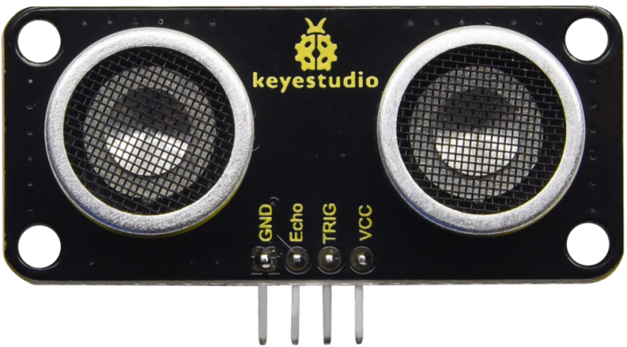

# Ultrasonic Distance Sensor
The ultrasonic distance sensor detects distance by sending an ultrasonic wave from one side and calculating the time it takes for it to bounce back to the receiver. There are multiple methods to receive these results, but all have their benefits and shortcomings.
## Hardware
For this tutorial we will be using the Arduino Uno and Keyestudio SR01 Ultrasonic sensors that you can find in your kits.



Here are some useful specifications on the ultrasonic sensor:
| | |
| - | - |
| Operating Voltage | DC 3.3V-5V |
| Size | 49mm * 22mm * 19mm |
| Min Range | <4cm |
| Max Range | 3M |
| Measuring Angle | <15 Degrees |
| Holes Diamater | 3mm |

### Circuit Setup


## Method 1: pulseIn()

This method is what is most widely used when starting out. It relies on **delayMicroseconds** to precisely send a 10 microsecond pulse following a burst of ultrasonic sound which ends when the echo of this sound is received. **pulseIn()** hence starts a timer when the sound is generated which stops when the echo returns, which allows you to measure the distance of an object in front of the sensor based on the speed of sound. This method is best for precision; it interrupts the program which ensures that the pulse sent is exact and that receiving the echo is top priority. The downside of this is that as you add more functions to your program, the delays may become detrimental to your code running well. It may also occasionally be incompatible with other libraries.

Below is some starting code, which will allow you to read the distance in centimeters.

```C++
int pingPin = 6;
int echoPin = 7;

void setup() {
  Serial.begin(9600);
  pinMode(6, OUTPUT);
  pinMode(7, INPUT);
}

void loop() {
  //additional 2 microsecond delay to ensure pulse clarity
  digitalWrite(pingPin, LOW);
  delayMicroseconds(2);
  digitalWrite(pingPin, HIGH);
  delayMicroseconds(10);
  digitalWrite(pingPin, LOW);

  //pulseIn waits for signal to go from HIGH to LOW, default timeout is 1000000
  unsigned long duration = pulseIn(echoPin, HIGH);
  //since sound travels roughly 29cm per microsecond we divide by 29
  //then again by 2 since the duration of the signal was equal to the sound traveling outward and back
  int cm = duration / 29 / 2;
  Serial.println(cm);
}
```

## Method 2: micros()

In general, this method follows the same principles of the first method, but relies on **micros()** instead of delays to operate. This is useful in cases where **delayMicroseconds** and **pulseIn()** may cause errors when used with other libraries but has a bit of jumpiness when it comes to the sensor data received.

The code below separates the processes of the operation into three functions. **sendPing()** is used to trigger the pulse and **detectEcho()** achieves the same goal as **pulseIn()**, starting a timer when the signal goes from LOW to HIGH, and stopping it when it goes from HIGH to LOW. **microsUltra()** is the main function that calls the others and takes three arguments, the syntax being ```microsUltra(trig pin, echo pin, timeout)```.

```C++
int pingPin = 6;
int echoPin = 7;
unsigned long maxDistance = 400;  //in centimeters

void setup() {
  Serial.begin(9600);
  pinMode(6, OUTPUT);
  pinMode(7, INPUT);
}

void loop() {
  microsUltra(pingPin, echoPin, maxDistance);
  //Your Code Here
}

void microsUltra(int pp, int ep, unsigned long to) {
  sendPing(pp, ep, to);
}

void sendPing(int pp, int ep, unsigned long to) {
  unsigned long timeStarted = micros();
  digitalWrite(pp, LOW);
  while (true) {
    if (micros() > timeStarted + 10) {
      digitalWrite(pp, LOW);
      break;
    } else if (micros() > timeStarted + 2) {
      digitalWrite(pp, HIGH);
    }
  }
  detectEcho(ep, to);
}

void detectEcho(int ep, unsigned long to) {
  unsigned long timeStarted = micros();
  unsigned long pTimeStarted = 0;
  unsigned long pTimeEnded = 0;
  int oldEcho = 0;
  while (true) {
    int echo = digitalRead(ep);
    if (echo == HIGH && oldEcho == LOW) {
      pTimeStarted = micros();
    } else if (echo == LOW && oldEcho == HIGH) {
      pTimeEnded = micros();
    }
    if (pTimeEnded >= pTimeStarted + 10) {
      unsigned long duration = pTimeEnded - pTimeStarted;
      unsigned long cm = duration / 29 / 2;
      Serial.println(cm);
      break;
    } else if (micros() > timeStarted + (to * 2 * 29)) {
      break;
    }
    oldEcho = echo;
  }
}
```

## Method 3: NewPing Library by Tim Eckel

The NewPing library was also developed in order to avoid the interruptions of Method 1. It operates similarly to Method 2, but being a library, also has some other features such as controlling ping intervals of sensors or controlling detection interval using Timer2 (Note: Using timer2 will disrupt PWM function and other libraries that also use it, such as the Tone Library). This method also has the issue of data having some bounce to it.

Below is the example code provided from the library to run a single ultrasonic sensor. Variables have been modified to match the circuit diagram above and the max range of the ultrasonic sensor in the kit.

```C++
// ---------------------------------------------------------------------------
// Example NewPing library sketch that does a ping about 20 times per second.
// ---------------------------------------------------------------------------

#include <NewPing.h>

#define TRIGGER_PIN  6  // Arduino pin tied to trigger pin on the ultrasonic sensor.
#define ECHO_PIN     7  // Arduino pin tied to echo pin on the ultrasonic sensor.
#define MAX_DISTANCE 400 // Maximum distance we want to ping for (in centimeters). Maximum sensor distance is rated at 400-500cm.

NewPing sonar(TRIGGER_PIN, ECHO_PIN, MAX_DISTANCE); // NewPing setup of pins and maximum distance.

void setup() {
  Serial.begin(9600); // Open serial monitor at 115200 baud to see ping results.
}

void loop() {
  delay(50);                     // Wait 50ms between pings (about 20 pings/sec). 29ms should be the shortest delay between pings.
  Serial.print("Ping: ");
  Serial.print(sonar.ping_cm()); // Send ping, get distance in cm and print result (0 = outside set distance range)
  Serial.println("cm");
}
```
