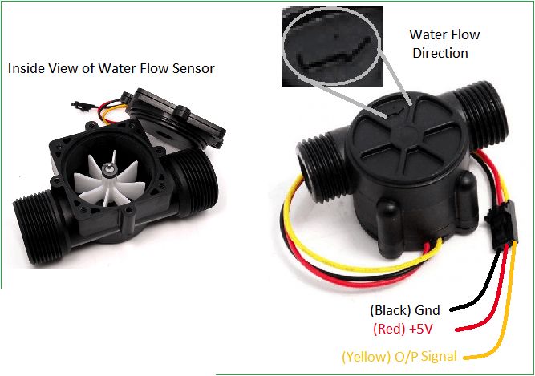
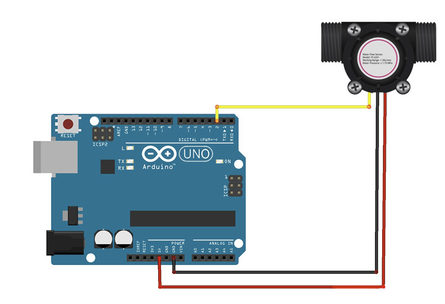

# Flow Sensor YF-S201

YF-S201 is a sensor used to measure water or air flow. This module works based on the hall magnetic effect. 
So when a fluid flows through the rotor assembly, the rotor will rotate and the hall effect sensor will produce an electric pulse.
By counting these generated pulses, the amount of water passing through the sensor can be calculated.

## Hardware

This sensor has 3 pins:

VCC: Module power supply – 5V
GND: Ground
OUT: Pulse output


### Circuit Setup

* 1 x Arduino Uno
* 3 x Jumper Wires
* 1 x  YF-S201 sensor


 

1. Connect the water flow sesnor as showcased on the diagram above.
2. Blow through the opening or let water flow though to get a reading.


## Code 1
Upload this code to your board and open the Serial Monitor to check how the flow in Liters. 

```C++

double flow;
int flowsensor = 2; 
unsigned long pulse_freq;

void setup(){
  pinMode(flowsensor, INPUT);
  Serial.begin(9600);
  attachInterrupt(0, pulse, RISING); 
}

void loop (){
    flow = .00225 * pulse_freq;
    Serial.print(flow, DEC);
    Serial.println("L");
    delay(500);
  }

void pulse (){
  pulse_freq++;
}

```


## Code 2
Upload this code to your board and open the Serial Monitor to check how the flow in liters per minute.

```C++

double flow;  
int flowsensor = 2; 
unsigned long currentTime;
unsigned long lastTime;
unsigned long pulse_freq;
 

void setup(){
   pinMode(flowsensor, INPUT);
   Serial.begin(9600);
   attachInterrupt(0, pulse, RISING); // Setup Interrupt
   currentTime = millis();
   lastTime = currentTime;
}

   void loop (){
   currentTime = millis();
   if(currentTime >= (lastTime + 1000)){   // Every second, calculate and print L/Min
      lastTime = currentTime; 
      flow = (pulse_freq / 7.5);  // Pulse frequency (Hz) = 7.5Q, Q is flow rate in L/min.
      pulse_freq = 0; // Reset Counter
      Serial.print(flow, DEC); 
      Serial.println(" L/Min");
   }
}

void pulse (){
   pulse_freq++;
}

```


